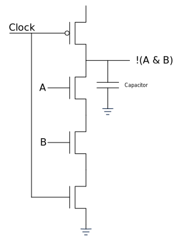

---
jupyter:
  jupytext:
    text_representation:
      extension: .md
      format_name: markdown
      format_version: '1.3'
      jupytext_version: 1.14.4
  kernelspec:
    display_name: C++17
    language: C++17
    name: xcpp17
---

```c++ slideshow={"slide_type": "skip"}
#include "../common.hpp"
```

<!-- #region slideshow={"slide_type": "slide"} -->
# Preface

- What is _better code_?
<!-- #endregion -->

<!-- #region slideshow={"slide_type": "fragment"} -->
- What is _good code_?
<!-- #endregion -->

<!-- #region slideshow={"slide_type": "fragment"} -->
- Goals:
    - Not prescriptive
    - Not always achievable
<!-- #endregion -->

<!-- #region slideshow={"slide_type": "fragment"} -->
- Not limited to C++
- Language is a constraint
<!-- #endregion -->

<!-- #region slideshow={"slide_type": "slide"} tags=[] -->
## Definitions
The term _raw_ appears in a couple of goals, and I'll use it frequently throughout this talk.

> The _raw_ usage of a construct means the construct should be considered too low-level and not used outside of a function or class whose primary purpose it to create a safe and efficient, higher level construct that can be used instead.
<!-- #endregion -->

<!-- #region slideshow={"slide_type": "fragment"} -->
Throughout these slides I use _word_ to mean a machine word, typically 64 bits on a 64 bit architecture and 32 bits on a 32 bit architecture. I do not mean a Win32 `WORD` type which is 16 bits.
<!-- #endregion -->

<!-- #region slideshow={"slide_type": "slide"} -->
## Philosophy

- _Correct_
- _Efficient_
    - On a wide variety of consumer and enterprise hardware
    - Balance CPU/GPU/ML/Memory/Storage/Power resources
- _Reusable_
- _Scalable_
    - With large data sets, but primarily on a single machine
<!-- #endregion -->

<!-- #region slideshow={"slide_type": "notes"} tags=[] -->
**Note:** What is not on this list:
- Readable: Not that I don't think readability is important, I think people put it too high on the list. Code isn't prose, code is math.
<!-- #endregion -->

<!-- #region slideshow={"slide_type": "slide"} -->
### Software is _Physics_

- Object are physical entities
- The building block for modern computers is the transistor
    - A transistor is simply an electronically controlled switch, similar to a relay but without moving parts
<!-- #endregion -->

<!-- #region slideshow={"slide_type": "slide"} -->
<center>
    
    <br>
    <em>Relay</em>
</center>
<!-- #endregion -->

<!-- #region slideshow={"slide_type": "slide"} -->
- To build a transistor, silicon is doped with a material such as Boron and Phosphorus
    - Silicon + Boron = P, fewer electrons, insulator
    - Silicon + Phosphorus = N, has _free_ electrons, conductive
<!-- #endregion -->

<!-- #region slideshow={"slide_type": "fragment"} -->
<center>
    
    <br>
    <em>Transistor Construction</em>
</center>
<!-- #endregion -->

<!-- #region slideshow={"slide_type": "slide"} -->
- We can make a NAND gate by combining two transistors
<!-- #endregion -->

<!-- #region slideshow={"slide_type": "fragment"} -->
<center>
    
    <br>
    <em>NAND Gate</em>
</center>
<!-- #endregion -->

<!-- #region slideshow={"slide_type": "slide"} -->
- A transistor is fast, but not infinitely fast, so we need a clock to delineate _which_ `A` and `B` the result applies to
<!-- #endregion -->

<!-- #region slideshow={"slide_type": "fragment"} -->
<center>
    
    <br>
    <em>CMOS NAND Gate</em>
</center>
<!-- #endregion -->

<!-- #region slideshow={"slide_type": "slide"} -->
- Combining two NAND gates with feedback creates a _sequential circuit_ and a simple memory cell, an SR latch
<!-- #endregion -->

<!-- #region slideshow={"slide_type": "fragment"} -->
<center>
    
    <br>
    <em>SR Latch</em>
</center>
<!-- #endregion -->

<!-- #region slideshow={"slide_type": "slide"} -->
- Combining SR Latches we can create a register
<!-- #endregion -->

<!-- #region slideshow={"slide_type": "fragment"} -->
<center>
    
    <br>
    <em>Register</em>
</center>
<!-- #endregion -->

<!-- #region slideshow={"slide_type": "slide"} -->
- By combining transistors with a clock to form sequential circuits we can make both memory and a processor
    - A modern CPU contains billions of transistors
<!-- #endregion -->

<!-- #region slideshow={"slide_type": "fragment"} -->
- The transistor count increases complexity
    - Memory hierarchy
    - Parallel execution
    - Speculative execution
    - Branch prediction
<!-- #endregion -->

<!-- #region slideshow={"slide_type": "fragment"} -->
- The fundamental physics don't change, for performance we want:
    - Simple operations
    - Executed sequentially
    - Operating on memory _near_ the processor
<!-- #endregion -->

<!-- #region slideshow={"slide_type": "slide"} -->
### Software is _Mathematics_
<!-- #endregion -->

<!-- #region slideshow={"slide_type": "fragment"} -->
- Not _pure_ mathematics
    - We are not describing systems on an idealized device that cannot be realized

- Mathematics is a tool to describe what _is_ and a tool to reason about code

- Software is defined on algebraic structures
<!-- #endregion -->
