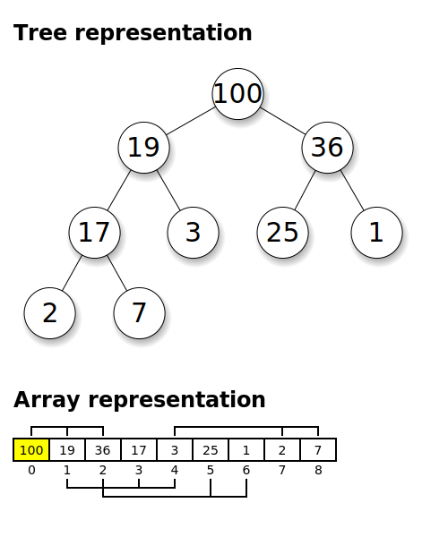

---
jupyter:
  jupytext:
    text_representation:
      extension: .md
      format_name: markdown
      format_version: '1.3'
      jupytext_version: 1.14.4
  kernelspec:
    display_name: C++17
    language: C++17
    name: xcpp17
---

```c++ slideshow={"slide_type": "skip"} tags=[]
#include "../common.hpp"

int a, b{0};
```

<!-- #region slideshow={"slide_type": "skip"} tags=[] -->
# Algorithms

**Goal: No raw loops**
<!-- #endregion -->

<!-- #region slideshow={"slide_type": "slide"} -->
# What's Your Function?
<!-- #endregion -->

<!-- #region slideshow={"slide_type": "notes"} tags=[] -->
Functions are often ignored but our our most useful abstraction for constructing software. We frequently focus on type hierarchies and object networks and ignore the basic function building block. In this talk we're going to explore just a bit about functions. This is a slice of my better code class that I'm preparing.
<!-- #endregion -->

<!-- #region slideshow={"slide_type": "skip"} tags=[] -->
> An _Algorithm_ is a process or set of rules to be followed in calculations or other problem-solving operations, especially by a computer. _&ndash; New Oxford American Dictionary_

<!-- #endregion -->

```c++ tags=[] slideshow={"slide_type": "slide"}
{
    int r = a < b ? a : b;
}
```

<!-- #region slideshow={"slide_type": "fragment"} tags=[] -->
- What does this line of code do?
<!-- #endregion -->

```c++ slideshow={"slide_type": "slide"} tags=[]
{
    // r is the minimum of a and b
    int r = a < b ? a : b;
}
```

<!-- #region slideshow={"slide_type": "fragment"} tags=[] -->
- A comment helps...
<!-- #endregion -->

```c++ slideshow={"slide_type": "slide"} tags=[]
{
    int r = min(a, b);
}
```

<!-- #region slideshow={"slide_type": "fragment"} tags=[] -->
- Naming an operation, even a simple operation, lowers cognitive overhead
<!-- #endregion -->

```c++ slideshow={"slide_type": "slide"} tags=[]
/// Returns the minimum of two integers
int min(int a, int b) {
    return a < b ? a : b;
}
```

<!-- #region slideshow={"slide_type": "fragment"} tags=[] -->
- A function allows us to associate a _name_ with _semantics_
<!-- #endregion -->

```c++ slideshow={"slide_type": "slide"} tags=[]
/// Returns the minimum of two integers
int min(int a, int b);
```

<!-- #region slideshow={"slide_type": "fragment"} tags=[] -->
- Functions allow us to build a vocabulary and focus the code does
<!-- #endregion -->

<!-- #region tags=[] slideshow={"slide_type": "skip"} -->
Myth of limited vocabulary
You do write class - and worry about names of types.
John McCall, Law of Exclusivity

Value of testing is pulling things out.

How people use regular expressions - instead of parsers.
<!-- #endregion -->

<!-- #region slideshow={"slide_type": "slide"} tags=[] -->
## Naming a Function (Guidelines)
<!-- #endregion -->

<!-- #region tags=[] -->
- Operations with the same semantics should have the same name
    - Follow existing conventions
- Name should describe the postconditions and make the use clear
- For properties and constant(ish) complexity operations use:
    - nouns: `capacity`
    - adjectives: `empty` (ambiguous but used by convention)
    - copular constructions: `is_blue`
<!-- #endregion -->

<!-- #region slideshow={"slide_type": "slide"} tags=[] -->
- For higher complexity operations use:
    - verbs: `partition`
        - `a = sort(b)` not `a = sorted(b)`
- For setting properties:
    - Prefix with the verb, `set_`, i.e. `set_capacity`
- Clarity is of highest priority. Don't construct unnatural verb phrases
    - `intersection(a, b)` not `calculate_intersection(a, b)`
    - `name` not `get_name`
<!-- #endregion -->

<!-- #region slideshow={"slide_type": "notes"} tags=[] -->
The `set_` prefix is borrowed from Objective-C. It avoids confusion over pairs like `size` and `resize` vs. `capacity` and `reserve`. But for those specific ones, follow convention.
<!-- #endregion -->

<!-- #region slideshow={"slide_type": "slide"} tags=[] -->
## Specifying a Function
<!-- #endregion -->

<!-- #region tags=[] -->
- at a minimum, the specification should be a sentence fragment defining the postconditions
- State any preconditions that are not clear from the types and conventions

```
/// Returns the truncated square root of `x`. `x` must be >= 0.
int sqrti(int x);
```
<!-- #endregion -->

<!-- #region tags=[] slideshow={"slide_type": "slide"} -->
## Argument Types
<!-- #endregion -->

<!-- #region tags=[] -->
- _let_: by-const-lvalue-reference or by-value for known small types and invocable types
- _inout_: by-lvalue-reference, prefer sink arguments and result to in-out arguments
- _sink_: by-rvalue-reference or by-value for known small types and to avoid forwarding references
<!-- #endregion -->

<!-- #region slideshow={"slide_type": "fragment"} tags=[] -->
spans, views, iterator pairs, and so on are a way to pass a range of objects as if they were a simple argument. The value_type of the range determines if it is _in_ (`const`), or _inout_ (not `const`) with input ranges (input iterators) used for _sink_.
<!-- #endregion -->

<!-- #region slideshow={"slide_type": "notes"} tags=[] -->
I need more experience with ranges here and specifically borrowed ranges to make a recommendation on sink (consumed ranges) and may make an exception for _set_ ranges.
<!-- #endregion -->

<!-- #region tags=[] slideshow={"slide_type": "slide"} -->
## Implicit Preconditions
<!-- #endregion -->

<!-- #region slideshow={"slide_type": "slide"} tags=[] -->
### Object Lifetimes
<!-- #endregion -->

<!-- #region tags=[] -->
- Caller must ensure referenced arguments are valid for duration of the call
<!-- #endregion -->

<!-- #region slideshow={"slide_type": "slide"} tags=[] -->
### Validity
<!-- #endregion -->

<!-- #region tags=[] -->
- An invalid object cannot be used as an argument
<!-- #endregion -->

<!-- #region tags=[] slideshow={"slide_type": "slide"} -->
### Law of Exclusivity
<!-- #endregion -->

```c++ tags=[]
{
    vector a{0, 0, 1, 0, 1, 2, 0, 1, 2, 3};
    erase(a, a[0]);
}
```

<!-- #region slideshow={"slide_type": "fragment"} tags=[] -->
- What is in `a` after this code?
<!-- #endregion -->

```c++ tags=[] slideshow={"slide_type": "slide"}
{
    vector a{0, 0, 1, 0, 1, 2, 0, 1, 2, 3};
    erase(a, a[0]);
    display(a);
}
```

<!-- #region slideshow={"slide_type": "fragment"} tags=[] -->
This fails because `a[0]` is passed by a reference aliasing the vector, `a`.
The standard is inconsistent in how it deals with aliasing with mutations. Unless aliasing is explicitly allowed, avoid it.
<!-- #endregion -->

```c++ tags=[] slideshow={"slide_type": "slide"}
{
    vector a{0, 0, 1, 0, 1, 2, 0, 1, 2, 3};
    erase(a, copy(a[0]));
    display(a);
}
```

<!-- #region slideshow={"slide_type": "slide"} tags=[] -->
The _Law of Exclusivity_ is borrowed from Swift and the term was coined by John McCall. To modify a variable, exclusive access to that variable is required. C++ does not enforce this rule, it must be manually enforced.
<!-- #endregion -->

<!-- #region slideshow={"slide_type": "slide"} tags=[] -->
The _Law of Exclusivity_ has far greater implications outside the scope of this talk. You might be interested in learning about the [Val language](https://www.val-lang.dev/).
<!-- #endregion -->

<!-- #region slideshow={"slide_type": "slide"} tags=[] -->
### Ranges
<!-- #endregion -->

<!-- #region tags=[] -->
- Iterator pairs denote a valid half-open interval
<!-- #endregion -->

```c++ slideshow={"slide_type": "fragment"} tags=[]
/// Transmogrify the elements in the range [f, l).
template <class ForwardIterator>
void transmogrify(ForwardIterator f, ForwardIterator l);
```

<!-- #region slideshow={"slide_type": "slide"} tags=[] -->
## Implicit Postconditions
<!-- #endregion -->

<!-- #region slideshow={"slide_type": "slide"} tags=[] -->
### Validity of References
<!-- #endregion -->

<!-- #region tags=[] -->
Any reference (pointer, iterator, etc.) to an object is assumed to be invalidated if the object is mutated.
<!-- #endregion -->

<!-- #region slideshow={"slide_type": "fragment"} tags=[] -->
A returned reference must be to one of the arguments to the function (or a part of one of the arguments) and is valid until the argument is modified or its lifetime ends.
<!-- #endregion -->

<!-- #region slideshow={"slide_type": "skip"} tags=[] -->
## Trivial vs Non-Trivial Algorithms

The term _algorithm_ covers all code. If an algorithm does not require iteration or recursion, it is a _trivial_ algorithm. Otherwise it is a non-trivial algorithm. The standard includes trivial algorithms such as `std::swap()` and `std::exchange()`, but for this section the focus is on non-trivial algorithms.
<!-- #endregion -->

<!-- #region slideshow={"slide_type": "slide"} -->
## Sequences

- For a sequence of _n_ elements their are _n + 1_ positions
<!-- #endregion -->

<!-- #region slideshow={"slide_type": "fragment"} -->
- How to represent a range of elements?
<!-- #endregion -->

<!-- #region slideshow={"slide_type": "fragment"} -->
- Problem with closed interval `[f, l]`?
<!-- #endregion -->

<!-- #region slideshow={"slide_type": "fragment"} -->
- Problem with open interval `(f, l)`?
<!-- #endregion -->

<!-- #region slideshow={"slide_type": "fragment"} -->
- Half-open intervals have significant advantages `[f, l)`
    - By strong convention we are open on the right
<!-- #endregion -->

<!-- #region slideshow={"slide_type": "fragment"} -->
- `[p, p)` represents an empty range, at position `p`
    - All empty ranges are not equal
<!-- #endregion -->

<!-- #region slideshow={"slide_type": "slide"} tags=[] -->
- Think of the positions as the lines between the elements
<!-- #endregion -->

<!-- #region slideshow={"slide_type": "slide"} -->
<center>
    
    <br>
    <em>Sequence With Pointers To Objects</em>
</center>
<!-- #endregion -->

<!-- #region slideshow={"slide_type": "slide"} -->
<center>
    
    <br>
    <em>Sequence With Pointers Between Objects</em>
</center>
<!-- #endregion -->

<!-- #region slideshow={"slide_type": "slide"} -->
- Limitations of half-open intervals
    - The last element cannot be enclosed if the position type is the same as the element type
    - i.e. You can't express the range `[INT_MIN, INT_MAX)` with type int
<!-- #endregion -->

<!-- #region slideshow={"slide_type": "slide"} -->
- There are different common ways to represent a half-open interval
<!-- #endregion -->

<!-- #region slideshow={"slide_type": "fragment"} -->
- A position `f` in a sequence can be denoted with an index, pointer, or iterator
    - The only requirement is that `f` be _incrementable_ to obtain the next element in the sequence
<!-- #endregion -->

<!-- #region slideshow={"slide_type": "fragment"} -->
- `[f, l)`
<!-- #endregion -->

<!-- #region slideshow={"slide_type": "fragment"} -->
- `[f, f + n) _n`
<!-- #endregion -->

<!-- #region slideshow={"slide_type": "fragment"} -->
- `[f, predicate()) _until`
<!-- #endregion -->

<!-- #region slideshow={"slide_type": "fragment"} -->
- `[f, is_sentinel())` NTBS
    - `const char*`
<!-- #endregion -->

<!-- #region slideshow={"slide_type": "slide"} tags=[] -->
- `[f, ...)` unbounded (dependent on something else)
    - i.e. range is required to be same or greater length than another range
<!-- #endregion -->

<!-- #region slideshow={"slide_type": "slide"} -->
- For a variable `a` in C and C++, it is guaranteed that `&a + 1` yields a valid, but not dereferenceable, pointer
    - `[&a, &a + 1)` is a valid range
<!-- #endregion -->

<!-- #region slideshow={"slide_type": "slide"} jp-MarkdownHeadingCollapsed=true tags=[] slideshow={"slide_type": "slide"} -->
## Common algorithms and their uses
<!-- #endregion -->

<!-- #region slideshow={"slide_type": "slide"} jp-MarkdownHeadingCollapsed=true tags=[] -->
- A great resource for finding standard algorithms:
  - https://en.cppreference.com/w/cpp/algorithm
<!-- #endregion -->

<!-- #region slideshow={"slide_type": "skip"} tags=[] -->
## Non-modifying sequence operations

- `find`
- `for_each`
- `count`
- `min` & `max`
<!-- #endregion -->

<!-- #region slideshow={"slide_type": "slide"} tags=[] -->
## Generic Algorithms
<!-- #endregion -->

- `find(f, l, a)` returns the position of the first element in the range `[f, l)` that is equal to `a`.

```c++ slideshow={"slide_type": "fragment"}
{
    int a[]{0, 1, 2, 3, 4, 5, 6, 7, 8, 9};
    display(*find(begin(a), end(a), 5));
}
```

<!-- #region slideshow={"slide_type": "fragment"} -->
**Question:** How do we know `find()` will _find_ a value?
<!-- #endregion -->

<!-- #region slideshow={"slide_type": "slide"} -->
- Iterator must meet the requirements of [_LegacyInputIterator_](https://en.cppreference.com/w/cpp/named_req/InputIterator)
- `[f, l)` must form a _valid range_
- the value type must be [_EqualityComparable_](https://en.cppreference.com/w/cpp/named_req/EqualityComparable) to the iterator `value_type`
<!-- #endregion -->

<!-- #region slideshow={"slide_type": "slide"} -->
## Requirements and Guarantees
<!-- #endregion -->
<!-- #region slideshow={"slide_type": "fragment"} -->
- A generic algorithm is specified in terms of a set of _requirements_ on its arguments. The requirements are a set of _concepts_ and _preconditions_ which, if satisfied, guarantee the algorithm performs as specified
- The C++ standard contains tables of [_named requirements_](https://en.cppreference.com/w/cpp/named_req) and [_concepts_](https://en.cppreference.com/w/cpp/header/concepts)
<!-- #endregion -->

<!-- #region slideshow={"slide_type": "fragment"} -->
- Concepts and Preconditions are closely related and both ideas are rooted in [_Hoare Logic_](https://en.wikipedia.org/wiki/Hoare_logic)


<!-- #endregion -->

<!-- #region slideshow={"slide_type": "slide"} -->
- A given type or operation _guarantees_ it satisfies some requirements
- Guarantees are provided by _modeling_ concepts, and ensuring postconditions and class invariants
- The description of each type in the standard will specify it _is a_ (model of) a concept as well as specifying the semantics (postconditions and class invariants) of operations and object properties
<!-- #endregion -->

<!-- #region slideshow={"slide_type": "slide"} -->
- By matching requirements with guarantees we create software which works
<!-- #endregion -->

<!-- #region slideshow={"slide_type": "slide"} -->
### Concept

The term _concept_ first appeared in the paper _Fundamentals of Generic Programming_:

> We call the set of axioms satisfied by a data type and a set of operations on it a _concept_.
<br> &emsp;&mdash; _Fundamentals of Generic Programming_, Dehnert & Stepanov
<!-- #endregion -->

<!-- #region slideshow={"slide_type": "fragment"} -->
In C++20, a language _concept_ is a set of syntactic requirements with a set of specified, in documentation, semantic and complexity requirements.
<!-- #endregion -->

<!-- #region slideshow={"slide_type": "fragment"} -->
- As with spoken language, we associate meaning with words
- Even this is controversial
<!-- #endregion -->

<!-- #region slideshow={"slide_type": "slide"} -->
> Names should not be associated with semantics because everybody has their own hidden assumptions about what semantics are, and they clash, causing comprehension problems without knowing why. This is why it's valuable to write code to reflect what code is actually doing, rather than what code "means": it's hard to have conceptual clashes about what code actually does.
<br> &emsp;&mdash; Craig Silverstein, personal correspondence
<!-- #endregion -->

<!-- #region slideshow={"slide_type": "slide"} -->
- _LegacyInputIterator_ and _EqualityComparable_ are concepts
<!-- #endregion -->

<!-- #region slideshow={"slide_type": "fragment"} -->
- Concept semantics usually are specified in terms of existential quantifiers ($\forall$, $\exists$)
<!-- #endregion -->

<!-- #region slideshow={"slide_type": "fragment"} -->
- However, they also imply a precondition that the argument is within the _domain of the operation_ (more discussion to follow).
<!-- #endregion -->

<!-- #region slideshow={"slide_type": "slide"} -->
#### Model

> We say that a concept is _modeled by_ specific types, or that the type _models_ the concept, if the requirements are satisfied for these types.
<!-- #endregion -->

- By stating that a type models a concept, a type is providing a guarantee that it may be used where a concept is required.

<!-- #region slideshow={"slide_type": "slide"} -->
### Contracts

_Contracts_, or _Design by Contract_, is a systematic approach to ensuring the values passed to, and returned by an operation satisfy specific assertions.
<!-- #endregion -->

<!-- #region slideshow={"slide_type": "fragment"} -->
> If the execution of a certain task relies on a routine call to handle one of its subtasks, it is necessary to specify the relationship between the client (the call- er) and the supplier (the called routine) as precisely as possible. The mechanisms for expressing such conditions are called assertions. Some assertions, called preconditions and postconditions, apply to individual routines. Others, the class invariants, constrain all the routines of a given class...
<br> &emsp;&mdash; _Applying "Design by Contract"_, Bertrand Meyer
<!-- #endregion -->

<!-- #region slideshow={"slide_type": "slide"} -->
#### Precondition
<!-- #endregion -->

- A _precondition_ is a condition that must be satisfied by the argument values to a function, or by the state of the system (a _global precondition_) for the operation to execute correctly.
- Correct execution can include returning an error.
- `[f, l)` must form a valid range is a precondition
- Not all preconditions can be asserted in code
    - i.e. `f(int* p)` with the precondition that `p` is dereferenceable
- We must still validate, prove, our code by hand
    - Most concepts can not be asserted in code (because existential quantifiers) and many preconditions cannot be asserted in code.

<!-- #region slideshow={"slide_type": "slide"} -->
- An aside:
    - A _secure interface_ is an interface where all preconditions can be, and are, validated
        - which can also be phrased as an interface _without preconditions_
    - A _secure system_ requires the interface is secure and all the code in the system is correct
<!-- #endregion -->

<!-- #region slideshow={"slide_type": "notes"} -->
**Note:** I never see this taught in classes on security, which tend to focus much more on safety. As someone who spent a fair amount of time in my youth hacking systems, I can tell you that looking for interfaces which cannot be validated is often a fast way into a system.
<!-- #endregion -->

<!-- #region slideshow={"slide_type": "slide"} -->
#### Postcondition

- A _postcondition_ is a guarantee about the result of an operation
- _result_ in this context is used broadly to include modified arguments and side-effects
<!-- #endregion -->

<!-- #region slideshow={"slide_type": "fragment"} -->
- For example,
> The result of `find(f, l, v)` is an iterator within the range `[f, l)`.

Is a postcondition of `find()`.
<!-- #endregion -->

<!-- #region slideshow={"slide_type": "slide"} -->
#### Class Invariant

- A _class invariant_ is a postcondition that applies to all operations, including construction, on a class
<!-- #endregion -->

<!-- #region slideshow={"slide_type": "slide"} -->
### Concepts, Partial Functions, and Domain
<!-- #endregion -->

Compare the description for the old [SGI STL LessThanComparable concept](https://www.boost.org/sgi/stl/LessThanComparable.html):

**Expression semantics**

| Name | Expression | Precondition                         | Semantics | Postcondition |
| -    | -          | -                                    | -         | -             |
| Less | `x < y`    | `x` and `y` are in the domain of `<` |           |               |

<!-- #region slideshow={"slide_type": "slide"} tags=[] -->
versus the [C++17 concept](https://eel.is/c++draft/utility.arg.requirements#tab:cpp17.lessthancomparable).

**Table 28: _CppLessThanComparable_ requirements**

| Expression | Return type           | Requirement                            |
| -          | -                     | -                                      |
| `a < b`    | convertible to `bool` | `<` is a strict weak ordering relation |

_In the SGI STL the requirement of [strict-weak-ordering](https://www.boost.org/sgi/stl/StrictWeakOrdering.html) was a separate concept._
<!-- #endregion -->

<!-- #region slideshow={"slide_type": "slide"} -->
Domain is defined in the C++ standard, but in the [context of _iterators_](https://eel.is/c++draft/iterator.cpp17#input.iterators-2). This passage used to refer to the _domain of operations_, but that has been narrowed to the _domain of_ `==`:
<!-- #endregion -->

<!-- #region slideshow={"slide_type": "slide"} -->
**The term _the domain of_ `==` is used in the ordinary mathematical sense to denote the set of values over which `==` is (required to be) defined. This set can change over time. Each algorithm places additional requirements on the domain of `==` for the iterator values it uses. These requirements can be inferred from the uses that algorithm makes of `==` and `!=`.**

| Expression | Return type | Operational Semantics | Assertion/note<br>pre-/post-condition |
| - | - | - | - |
| `a != b` | contextually convertible to `bool` | `!(a == b)` | _Preconditions:_ (`a, b`) is in the domain of `==` |

<!-- #endregion -->

What was part of the definition of concepts in general has been weakened to a requirement for a single operation on iterators.

<!-- #region slideshow={"slide_type": "slide"} -->
- I've proposed to fix this in [P2345](https://sean-parent.stlab.cc/2021/03/31/relaxing-requirements-of-moved-from-objects.html):
<!-- #endregion -->

<!-- #region slideshow={"slide_type": "fragment"} -->
> The term domain of the operation is used in the ordinary mathematical sense to denote the set of values over which an operation is (required to be) defined. This set can change over time. Each component may place additional requirements on the domain of an operation. These requirements can be inferred from the uses that a component makes of the operation and is generally constrained to those values accessible through the operation’s arguments.
<!-- #endregion -->

<!-- #region slideshow={"slide_type": "slide"} -->
> A _partial_ function is a function whose domain is a subset of the values for the type of the operands
<!-- #endregion -->

<!-- #region slideshow={"slide_type": "fragment"} -->
- Because machines are physical and finite, many operations are partial
    - addition on signed integers for example
<!-- #endregion -->

<!-- #region slideshow={"slide_type": "fragment"} -->
- Learn to manage partial functions with care to ensure values are within the functions domain
<!-- #endregion -->

<!-- #region slideshow={"slide_type": "slide"} -->
### Axes of Freedom
<!-- #endregion -->

<!-- #region tags=[] -->
- Guarantees can be strengthened without breaking existing code
<!-- #endregion -->

<!-- #region slideshow={"slide_type": "fragment"} -->
- i.e. `std::basic_string()` only guarantees the value of a moved-from string is valid
    - in the future it could guarantee the value is empty without breaking any code
<!-- #endregion -->

<!-- #region slideshow={"slide_type": "slide"} -->
- Requirements can be weakened without breaking existing code
<!-- #endregion -->

<!-- #region slideshow={"slide_type": "fragment"} -->
- i.e. `std::merge()` currently requires a strict-weak ordering
    - in the future that could be relaxed to a partial-ordering without breaking any code
<!-- #endregion -->

<!-- #region slideshow={"slide_type": "slide"} -->
- Weakening a guarantee or strengthening a requirement is a breaking change
    - best handled by introducing a new name for the type or operation
<!-- #endregion -->

<!-- #region slideshow={"slide_type": "skip"} tags=[] -->
## Modifying sequence operations

- `copy`
- `move`
- `transform`
- `generate`
- `remove` & `unique`
<!-- #endregion -->

<!-- #region slideshow={"slide_type": "skip"} tags=[] -->
- The basic non-modifying and modifying sequence operations are all very common
<!-- #endregion -->

<!-- #region slideshow={"slide_type": "skip"} tags=[] -->
- The standard only provides a small number of possible, useful, interfaces to these operations
- Keep a library of useful variants and add to them
<!-- #endregion -->

<!-- #region slideshow={"slide_type": "slide"} -->
### OutputIterators and _sink_ functions
<!-- #endregion -->

<!-- #region slideshow={"slide_type": "fragment"} -->
- OutputIterators are isomorphic with a _sink_ function object
    - Function objects are simpler to write with lambda expressions
<!-- #endregion -->

<!-- #region slideshow={"slide_type": "fragment"} -->
- `std::fill()`, `std::iota()` and `std::generate()` would be better expressed with output iterators and sink function forms:
<!-- #endregion -->

```c++ slideshow={"slide_type": "slide"}
namespace bcc {

template <class T, class F>
constexpr void iota(T first, T last, F out) {
    for (; first != last; ++first) {
        out(first);
    }
}

} // namespace bcc
```

```c++ slideshow={"slide_type": "fragment"}
{
    vector<int> v;
    bcc::iota(0, 10, [&](int n) { v.push_back(n); });
    display(v);
}
```

<!-- #region slideshow={"slide_type": "fragment"} -->
- Every algorithm using an output iterator should have a corresponding form with a sink function
<!-- #endregion -->

<!-- #region slideshow={"slide_type": "slide"} -->
### Algorithm Semantics
<!-- #endregion -->

- The following code attempts to remove the first odd element from a sequence

```c++
{
    vector a{0, 1, 2, 3, 4, 5};

    erase_if(a, [n = 0](int x) mutable {
        return (x & 1) && !n++;
    });
    display(a);
}
```

<!-- #region slideshow={"slide_type": "fragment"} -->
**Question:** What went wrong?
<!-- #endregion -->

<!-- #region slideshow={"slide_type": "slide"} -->
```cpp
template <class F, class P>
auto remove_if(F f, F l, P pred) {
    f = find_if(f, l, pred); // <-- pred is passed by value

    if (f == l) return f;

    for (auto p = next(f); p != l; ++p) {
        if (!pred(*p)) *f++ = move(*p);
    }
    return f;
}
```
<!-- #endregion -->

```c++ slideshow={"slide_type": "slide"}
{
    vector<int> a{0, 1, 2, 3, 4, 5};

    int n = 0;
    auto first_is_odd = [&n](int x) {
        return (x & 1) && !n++;
    };

    erase_if(a, first_is_odd);
    display(a);
}
```

<!-- #region slideshow={"slide_type": "fragment"} -->
**Question:** Does the above code fix the issue?
<!-- #endregion -->

<!-- #region slideshow={"slide_type": "slide"} -->
- The requirement is that `pred` is a regular, _pure_, function although the [standard wording](https://eel.is/c++draft/algorithms#requirements-7) is obtuse:

> Given a glvalue `u` of type (possibly `const`) `T` that designates the same object as `*first`, `pred(u)` shall be a valid expression that is equal to `pred(*first)`.
<!-- #endregion -->

<!-- #region slideshow={"slide_type": "fragment"} -->
- There is no filter operation in the standard which guarantees the predicate is evaluated exactly N-times, in order. If you need it, write it.
<!-- #endregion -->

<!-- #region slideshow={"slide_type": "slide"} -->
## Positional Permutations
<!-- #endregion -->

<!-- #region slideshow={"slide_type": "fragment"} -->
- `rotate`
- `reverse`
- `swap`, `swap_ranges`
- `shuffle`
- `next_permutation`
<!-- #endregion -->

<!-- #region slideshow={"slide_type": "fragment"} -->
- _Positional permutation_ reorder object based on their position, not their value
<!-- #endregion -->

<!-- #region slideshow={"slide_type": "slide"} -->
- The algorithms in the standard library are basic building blocks for higher level algorithms
- As we saw with `remove_if()`, many algorithms in the standard library are implemented in terms of other algorithms in the library
- When confronted with a problem that is not a direct match to a standard algorithm, try and decompose the problem into one or more standard algorithms
<!-- #endregion -->

<!-- #region slideshow={"slide_type": "slide"} -->
<center>
    <iframe data-src="./img/algorithm-slide/index.html"></iframe>
    <em>Slide Algorithm</em>
</center>
<!-- #endregion -->

<!-- #region slideshow={"slide_type": "slide"} -->
- All permutations algorithms can be decomposed into a series of cycles
- Each cycle of length n requires n+1 move operations
- `swap_ranges()` and `reverse()` are the worst case, where every cycle is length 2 and requires 3 moves
    - to reverse a sequence of `n` elements requires `(n / 2) * 3` moves
<!-- #endregion -->

<!-- #region slideshow={"slide_type": "slide"} -->
<center>
    
    <br>
    <em>Reverse Cycles</em>
</center>
<!-- #endregion -->

<!-- #region slideshow={"slide_type": "fragment"} -->
- A two-element cycle is implemented with `swap()`
<!-- #endregion -->

<!-- #region slideshow={"slide_type": "slide"} -->
**Exercise:** Write an algorithm, `swirl()`, that implements the following single cycle permutation.
<!-- #endregion -->

<!-- #region slideshow={"slide_type": "fragment"} -->
<center>
    
    <br>
    <em>Swirl</em>
</center>
<!-- #endregion -->

<!-- #region slideshow={"slide_type": "slide"} -->
<center>
    
    <br>
    <em>Swirl (Even)</em>
</center>
<!-- #endregion -->

```c++ slideshow={"slide_type": "slide"}
namespace v0 {

template <class I>
void swirl(I f, I l) {
    auto m = next(f, distance(f, l) / 2);
    if (f == m) return;
    m = rotate(f, m, l);
    reverse(m, l);
    ++f;
    reverse(f, m);
}

} // namespace v0
```

```c++ slideshow={"slide_type": "fragment"}
{
    using namespace v0;

    int a[]{0, 1, 2, 3, 4, 5, 6, 7, 8};
    swirl(begin(a), end(a));

    display(a);
}
```

<!-- #region slideshow={"slide_type": "slide"} -->
**Question:** What are the requirements for `I`, `f`, and `l`?
<!-- #endregion -->

```c++ slideshow={"slide_type": "slide"}
namespace v1 {

template <class I>
void swirl(I f, I l) {
    reverse(f, l);
    auto m = next(f, distance(f, l) / 2);
    if (m == l) return;
    rotate(f, m, next(m));
}

} // namespace v1
```

```c++ slideshow={"slide_type": "fragment"}
{
    using namespace v1;

    int a[]{0, 1, 2, 3, 4, 5, 6, 7, 8};
    swirl(begin(a), end(a));

    display(a);
}
```

<!-- #region slideshow={"slide_type": "slide"} -->
- As a general rule, an algorithm should not throw away information it calculated that the caller can't easily (small constant time) reconstruct.
<!-- #endregion -->

<!-- #region slideshow={"slide_type": "fragment"} -->
- `swirl` computes the mid-point, so it is a good thing to return
<!-- #endregion -->

<!-- #region slideshow={"slide_type": "fragment"} -->
- (Unfortunately, `std::reverse()` throws it away!)
<!-- #endregion -->

```c++ slideshow={"slide_type": "fragment"}
namespace v2 {

template <class I>
I swirl(I f, I l) {
    reverse(f, l);
    auto m = next(f, distance(f, l) / 2);
    if (m == l) return m;
    rotate(f, m, next(m));
    return m;
}

} // namespace v1
```

<!-- #region slideshow={"slide_type": "fragment"} -->
**Homework:** Implement `swirl` with the minimum number of moves
<!-- #endregion -->

<!-- #region slideshow={"slide_type": "slide"} -->
## Predicate Permutations
<!-- #endregion -->

<!-- #region slideshow={"slide_type": "fragment"} -->
- `partition` & `stable_partition`
<!-- #endregion -->

<!-- #region slideshow={"slide_type": "fragment"} -->
_Predicate permutations_ use a predicate function to determine ordering. These algorithms partition the set into two sets. A _stable partition_ algorithm preserves the relative order of the elements in each set.
<!-- #endregion -->

<!-- #region slideshow={"slide_type": "slide"} -->
<center>
    <iframe data-src="./img/algorithm-gather/index.html"></iframe>
    <em>Gather Algorithm</em>
</center>
<!-- #endregion -->

<!-- #region slideshow={"slide_type": "slide"} -->
## Comparison Permutations
<!-- #endregion -->

<!-- #region slideshow={"slide_type": "fragment"} -->
- `sort`, `stable_sort`, & `partial_sort`
- `nth_element`
- `make_heap`
<!-- #endregion -->

<!-- #region slideshow={"slide_type": "fragment"} -->
_Comparison permutations_ use a comparison function to map an ordering of the values to an ordering of their position
<!-- #endregion -->

<!-- #region slideshow={"slide_type": "slide"} -->
- Comparison function is required to be a _strict-weak ordering_:

> An ordering relation, $\prec$, is a _strict-weak_ ordering iff

\begin{align}
(a & \nprec a). && \text{(Irreflexivity)} \\
(a & \prec b) \wedge (b \prec c) \implies a \prec c. && \text {(Transitivity)} \\
(a & \equiv b) \wedge (b \equiv c) \implies a \equiv c. && \text {(Equivalence Transitivity)}\\
\end{align}

> Where $a$ and $b$, are _equivalent_, $\equiv$, iff $(a \nprec b) \wedge (b \nprec a)$.
<!-- #endregion -->

<!-- #region slideshow={"slide_type": "slide"} -->
- The default is to use `operator<()`
- On a type, the expectation is that `operator<()` is a _total ordering_
    - Which is consistent with other operations on the type

> A _total ordering_ is a strict-weak ordering where the defined equivalence is equality
<!-- #endregion -->

<!-- #region slideshow={"slide_type": "fragment"} -->
- `operator<()` is not defined on `std::complex<>` because there is no definition consistent with multiplication
    - For example, both $i > 0$ and $i < 0$ imply that $0 < i^2$, however, $i^2 = -1$
<!-- #endregion -->

<!-- #region slideshow={"slide_type": "slide"} -->
- Despite `nan` values, both `float` and `double` are totally-ordered because `nan` is explicitly outside the value domain for floating point types
    - `nan` is _not a number_
- A floating point object containing `nan` is partially formed
- Don't try and sort a sequence containing `nan` values with `operator<()`
    - The result is UB and will likely crash

C++20 defines the ordering on floating-point types as a `std::partial_ordering` because of `nan` values. I find this complicates matters unnecessarily, and means the requirements of the comparison operator cannot be defined with a _concept_ but require a precondition. See prior discussion of domain of an operation.
<!-- #endregion -->

<!-- #region slideshow={"slide_type": "slide"} -->
- The `sort` and `nth element` operations establish a direct relationship between the order of elements and their position in the sequence.
- `make_heap` orders the elements as a _max heap_
<!-- #endregion -->

<!-- #region slideshow={"slide_type": "slide"} -->
<center>
    
    <br>
    <em>Max Heap</em>
    <br>
    <small >&mdash; <a href="https://commons.wikimedia.org/w/index.php?curid=12251273">By Ermishin - Own work, CC BY-SA 3.0</a></small>
</center>
<!-- #endregion -->

<!-- #region slideshow={"slide_type": "slide"} -->
- `make_heap`, and the related heap operation are included in the standard library because they are used by `sort`
- `sort` in the standard library is an _introsort_, which is an introspective quicksort that switches to _heap sort_ when the recursion depths exceeds a level $k \cdot log(n)$
<!-- #endregion -->

<!-- #region slideshow={"slide_type": "slide"} -->
- `nth_element` sorts a sequence _enough_ so that the specified element is in the correct location
- A postcondition of `nth_element` is that the sequence is partitions such that every element before the nth element is less than or equal to it, and every element after is greater than or equal.
<!-- #endregion -->

<!-- #region slideshow={"slide_type": "slide"} -->
- With `nth_element` and `partial_sort` you can sort a subrange of a sequence as if the entire range where sorted
- This has the same time complexity as a full sort, $n \cdot log(n)$, but can be considerably faster
<!-- #endregion -->

<!-- #region slideshow={"slide_type": "fragment"} -->
- This is very useful when you want to sort a "window" view into a large sequence
<!-- #endregion -->

```c++ slideshow={"slide_type": "slide"}
template <class I> // I models RandomAccessIterator
void sort_subrange_0(I f, I l, I sf, I sl) {
    std::sort(f, l);
}

template <class I> // I models RandomAccessIterator
void sort_subrange(I f, I l, I sf, I sl) {
    if (f != sf && sf != l) {
        std::nth_element(f, sf, l); // partition [f, l) at sf
        ++sf;
    }
    std::partial_sort(sf, sl, l);
}
```

<!-- #region slideshow={"slide_type": "slide"} -->
<center>
    
    <br>
    <em><a href='http://quick-bench.com/C0fww_d39OVBvCnoNrXUN5XU0nE'>Benchmark Code</a></em>
</center>
<!-- #endregion -->

<!-- #region slideshow={"slide_type": "slide"} -->
## Operations on sorted sequences

- `lower_bound`, `upper_bound`, `equal_range`, `binary_search`
<!-- #endregion -->

- `merge`


- `includes`, `set_difference`, `set_intersection`, `set_symmetric_difference`, `set_union`


- `lower_bound` should is the most commonly used way to do a binary search for an element in a sequence

```c++
{
    int a[]{ 0, 1, 2, 3, 3, 3, 4, 4, 5, 6 };
    auto p = lower_bound(begin(a), end(a), 3);
    display(a);
    cout << string(distance(begin(a), p) * 3 + 1, ' ') << "^\n";
}
```

<!-- #region slideshow={"slide_type": "slide"} -->
### Projections
<!-- #endregion -->

<!-- #region slideshow={"slide_type": "fragment"} -->
- The range algorithms in C++20 contain projection arguments
<!-- #endregion -->

<!-- #region slideshow={"slide_type": "fragment"} -->
- Projections are very useful with the comparison permutations and operations on sorted sequences to provide symmetry
<!-- #endregion -->

```c++ slideshow={"slide_type": "slide"}
{
    struct employee {
        string _first;
        string _last;
    };

    employee a[]{{"Joe", "Zimmer"}, {"Frank", "Berse"}};

    sort(begin(a), end(a), [](const employee& a, const employee& b) {
        return a._last < b._last;
    });
    auto p = lower_bound(begin(a), end(a), "Zimmer"s, [](const employee& a, const string& b) {
        return a._last < b;
    });

    display(p->_first);
}
```

<!-- #region slideshow={"slide_type": "slide"} -->
```cpp
{
    struct employee {
        string _first;
        string _last;
    };

    employee a[]{{"Joe", "Zimmer"}, {"Frank", "Berse"}};

    ranges::sort(a, less<>(), &employee::_last);
    auto p = ranges::lower_bound(a, "Zimmer"s, less<>(), &employee::_last);

    display(p->_first);
}
```

```
"Joe"
```
<!-- #endregion -->

<!-- #region slideshow={"slide_type": "slide"} -->
## Iterator hierarchy (and why you probably shouldn't care)
<!-- #endregion -->

<!-- #region slideshow={"slide_type": "slide"} -->
## Composition vs. multi-pass
<!-- #endregion -->

<!-- #region slideshow={"slide_type": "slide"} -->
## Generators vs input iterator
<!-- #endregion -->

<!-- #region slideshow={"slide_type": "slide"} -->
## Heap operations

- `make_heap`, `push_heap`, `pop_heap`, `sort_heap`
<!-- #endregion -->

<!-- #region slideshow={"slide_type": "fragment"} -->
- `priority_queue`
<!-- #endregion -->

<!-- #region slideshow={"slide_type": "fragment"} -->
**Exercise:** Create a `priority_queue` of `my_type`.
<!-- #endregion -->

<!-- #region slideshow={"slide_type": "fragment"} -->
- Can you move out the top element?
<!-- #endregion -->

<!-- #region slideshow={"slide_type": "fragment"} -->
**Exercise:** Create a new `priority_queue` adapter that supports move using the heap operations.
<!-- #endregion -->

<!-- #region tags=[] slideshow={"slide_type": "notes"} -->
\[
- discuss (show graph) of O(1), O(log(N)), O(N), O(N log(N)
\]
<!-- #endregion -->
