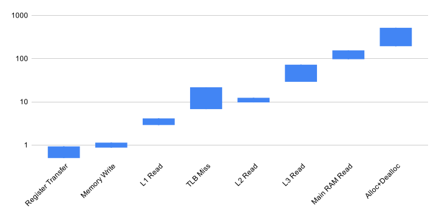

---
jupyter:
  jupytext:
    text_representation:
      extension: .md
      format_name: markdown
      format_version: '1.3'
      jupytext_version: 1.14.4
  kernelspec:
    display_name: C++17
    language: C++17
    name: xcpp17
---

```c++ slideshow={"slide_type": "skip"}
#include "../common.hpp"
```

<!-- #region slideshow={"slide_type": "slide"} -->
# Data Structures

**Goal: No incidental data structures**
<!-- #endregion -->

<!-- #region slideshow={"slide_type": "slide"} -->
## Definitions

> **Classic:** A _data structure_ is a format for organizing and storing data.
<!-- #endregion -->

<!-- #region slideshow={"slide_type": "fragment"} -->
- Doesn't define _structure_, replaces it with the related word, _format_
<!-- #endregion -->

<!-- #region slideshow={"slide_type": "fragment"} -->
- In mathematics, _structure_ is defined as:

> A _structure_ on a set consists of additional entities that, in some manner, relate to the set, endowing the collection with meaning or significance.
<!-- #endregion -->

<!-- #region slideshow={"slide_type": "slide"} -->
- A type is a pattern for storing and modifying objects
- A type is a structure that relates a set of objects to a set of values
    - This is a _representational_ relationship
- A representational relationship creates a _trivial data structure_ consisting of a single value

- Values are related to other values, i.e. $3 \neq 4$
<!-- #endregion -->

<!-- #region slideshow={"slide_type": "slide"} -->
- Because objects exist in memory, they have a _physical_ relationship

> A _data structure_ is a structure utilizing value, representational, and physical relationships to encode semantic relationships on a collection of objects

- The choice of encoding can make a dramatic difference on the performance of operations
<!-- #endregion -->

<!-- #region slideshow={"slide_type": "slide"} -->
<center>
    
    <br>
    <em>Data from <a href='http://ithare.com/infographics-operation-costs-in-cpu-clock-cycles/'>IT Hare</a></em>
</center>
<!-- #endregion -->

<!-- #region slideshow={"slide_type": "notes"} -->
TLB is _Translation Look-aside Buffer_ - or _cache miss_
<!-- #endregion -->

<!-- #region slideshow={"slide_type": "slide"} -->
- A data structure is created anytime a relationship is established between objects
- To avoid confusion we will reserve the term _data structure_ to refer to types with a set of invariants which insure a set of relationships are maintained. i.e. standard containers
- More transient data structures will be referred to as _structured data_
<!-- #endregion -->

<!-- #region slideshow={"slide_type": "slide"} -->
## Encoding Semantic Relationships
<!-- #endregion -->

- Three primary means to encode a semantic relationship
    - Physically, using relative location in memory
        - `{3, 4, 5}` `3` is before `4` and `3` is less-than `4`
    - Value, use an object with a value to represent the relationship
        - `struct list { int _data, list* _next };` the value of `_next` encodes an ordered relationship
    - Representational, use the representation of the object to encode a relationship about the values of the objects
        - `hash(a) == hash(b)` $\implies$ `a == b`


<!-- #region slideshow={"slide_type": "slide"} tags=[] -->
\[
    Everything from here down is notes...
\]
<!-- #endregion -->

```c++
namespace bcc {

template <class T, class O>
void iota(T f, T l, O out) {
    while (f != l) {
        out(f);
        ++f;
    }
}

} // namespace bcc
```

```c++
%%timeit
{
std::list<int> _list;
bcc::iota(0, 1'000'000, [&](int n){ _list.push_back(n); });
}
```

```c++
%%timeit
{
std::vector<int> _vector;
bcc::iota(0, 1'000'000, [&](int n){ _vector.push_back(n); });
}
```

```c++
std::list<int> _list;
bcc::iota(0, 1'000'000, [&](int n){ _list.push_back(n); });
```

```c++ slideshow={"slide_type": "skip"}
std::vector<int> _vector;
bcc::iota(0, 1'000'000, [&](int n){ _vector.push_back(n); });
```

```c++
%timeit std::find(begin(_list), end(_list), 500'000);
```

```c++
%timeit std::find(begin(_vector), end(_vector), 500'000);
```

```c++
%timeit _list.insert(std::find(begin(_list), end(_list), 500'000), 42);
```

```c++
%timeit _vector.insert(std::find(begin(_vector), end(_vector), 500'000), 42);
```

```c++
%timeit -n 1000 _list.push_front(42);
```

```c++
%timeit -n 1000 _vector.insert(begin(_vector), 42);
```

- If you only need `push_front()`, `std::deque<>` is a better choice
- `std::list<>` only makes since when you are externally indexing and hence require iterator stability

<!-- #region slideshow={"slide_type": "skip"} -->
\[

Show performance difference with std::list.
Discuss how big O() advantages are frequently lost.
Problem with deque (two-level iteration never implemented).
Map vs. Hashmap - and better flat hash map implementation available

Almost every major application sits on just one, or a very small number of data-structures or algorithms. Show Ps layer/tile structure. Google is built on map-reduce (cover map-reduce in algorithms).

include iota implementation in algorithm section

\]
<!-- #endregion -->

<!-- #region slideshow={"slide_type": "slide"} -->
## Problem
<!-- #endregion -->

```c++

```
