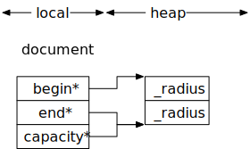
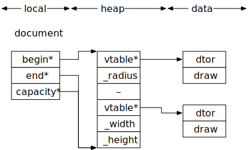

---
jupyter:
  jupytext:
    text_representation:
      extension: .md
      format_name: markdown
      format_version: '1.3'
      jupytext_version: 1.14.4
  kernelspec:
    display_name: C++17
    language: C++17
    name: xcpp17
---

```c++ slideshow={"slide_type": "skip"}
#include "../common.hpp"
```

# Runtime Polymorphism

<!-- #region slideshow={"slide_type": "fragment"} -->
**Goal: No _raw pointers_**
<!-- #endregion -->

<!-- #region slideshow={"slide_type": "slide"} tags=[] -->
## Definitions
<!-- #endregion -->

<!-- #region slideshow={"slide_type": "fragment"} tags=[] -->
> A _raw pointer_ is any type with owning pointer semantics including:
> - `T*`
> - `shared_ptr<T>`
> - `unique_ptr<T>`
> - `weak_ptr<T>`
>
> It does not include _iterators_, even if the iterator is a pointer type, or a pointer used to represent an optional reference
<!-- #endregion -->

<!-- #region slideshow={"slide_type": "slide"} -->
> _Polymorphism_ is the provision of a single interface to entities of different types.
<!-- #endregion -->

<!-- #region slideshow={"slide_type": "slide"} -->
## Motivation
<!-- #endregion -->

<!-- #region slideshow={"slide_type": "fragment"} -->
In C++, runtime polymorphism is typically achieved with _subtyping_ using _inheritance_.

- _Inheritance_ is a mechanism to where one class is _derived_ from another class, but overriding all or part of the implementation.
<!-- #endregion -->

<!-- #region slideshow={"slide_type": "fragment"} -->
- The requirement of runtime-polymorphism within a system comes from the need to use objects of different but _related_ types
<!-- #endregion -->

```c++ slideshow={"slide_type": "slide"}
namespace v3 {

using circle = int;

void draw(const circle& a, ostream& out, size_t position) {
    out << string(position, ' ') << "circle: " << a << "\n";
}

using document = vector<circle>;

void draw(const document& a, ostream& out, size_t position) {
    out << string(position, ' ') << "{\n";
    for (const auto& e : a)
        draw(e, out, position + 2);
    out << string(position, ' ') << "}\n";
}

} // namespace v3
```

```c++ slideshow={"slide_type": "slide"}
{
    using namespace v3;

    document d;

    d.emplace_back(circle{5});
    d.emplace_back(circle{42});
    draw(d, cout, 0);
}
```

<!-- #region slideshow={"slide_type": "slide"} -->
<center>
    
    <br>
    <em>Concrete Document Structure</em>
</center>
<!-- #endregion -->

```c++ slideshow={"slide_type": "slide"}
namespace v4 {

class shape {
public:
    virtual ~shape() = default;
    virtual void draw(ostream&, size_t) const = 0;
};

using document = vector<shared_ptr<shape>>;

void draw(const document& a, ostream& out, size_t position) {
    out << string(position, ' ') << "{\n";
    for (const auto& e : a)
        e->draw(out, position + 2);
    out << string(position, ' ') << "}\n";
}

} // namespace v4
```

```c++ slideshow={"slide_type": "slide"}
namespace v4 {

class circle final : public shape {
    int _radius;

public:
    explicit circle(int radius) : _radius{radius} {}
    void draw(ostream& out, size_t position) const override {
        out << string(position, ' ') << "circle: " << _radius << "\n";
    }
};

} // namespace v4
```

```c++ slideshow={"slide_type": "slide"}
namespace v4 {

class rectangle final : public shape {
    int _width, _height;
public:
    explicit rectangle(int width, int height) : _width{width}, _height{height} {}
    void draw(ostream& out, size_t position) const override {
        out << string(position, ' ') << "rectangle: " << _width << ", " << _height << "\n";
    }
};

} // namespace 4
```

```c++ slideshow={"slide_type": "slide"}
{
    using namespace v4;

    document d;

    d.emplace_back(new circle{5});
    d.emplace_back(new rectangle{10, 42});
    draw(d, cout, 0);
}
```

<!-- #region slideshow={"slide_type": "slide"} -->
- This line contains a defect:
```cpp
    d.emplace_back(new circle{5});
```
- An instance of `circle` will be allocated first
- Then the document will grow to make room
- If growing the document throws an exception, the memory from `circle` is leaked
<!-- #endregion -->

- The interface leaves it to the client to get correct

```c++ slideshow={"slide_type": "slide"}
{
    using namespace v4;

    document d;

    d.push_back(make_shared<circle>(5));
    d.push_back(make_shared<rectangle>(10, 42));
    draw(d, cout, 0);
}
```

<!-- #region slideshow={"slide_type": "slide"} -->
## Issues with inheritance and shared pointers
<!-- #endregion -->

<!-- #region slideshow={"slide_type": "fragment"} -->
Pointers create incidental data structures
<!-- #endregion -->

<!-- #region slideshow={"slide_type": "fragment"} -->
### Breaks local reasoning

- Our document _could_ share objects with other components
    - If we wanted to asynchronously save our document, how do we ensure it doesn't change?
<!-- #endregion -->

<!-- #region slideshow={"slide_type": "slide"} -->
### Breaks copying and changes the definition of what it means for two documents to be equal

- Copies are disjoint and equal
- For two documents to be equal they now need to hold _identical_ shapes
<!-- #endregion -->

<!-- #region slideshow={"slide_type": "fragment"} -->
### Imposes additional requirement on the client

- Inheritance is intrusive, now our rectangle has become logically part of the system using it
    - But there are _a lot_ of other uses for rectangle besides a shape in our document
- Forces the client to allocate and manage memory
<!-- #endregion -->

<!-- #region slideshow={"slide_type": "slide"} -->
### Considerably Less Efficient
<!-- #endregion -->

<!-- #region slideshow={"slide_type": "fragment"} -->
**Question:** What is the size of a `shared_ptr<>`?
<!-- #endregion -->

```c++ slideshow={"slide_type": "fragment"}
sizeof(shared_ptr<int>) / sizeof(void*)
```

<!-- #region slideshow={"slide_type": "slide"} -->
<center>
    
    <br>
    <em>Document Structure</em>
</center>
<!-- #endregion -->

<!-- #region slideshow={"slide_type": "slide"} -->
<center>
    
    <br>
    <em>Data from <a href='http://ithare.com/infographics-operation-costs-in-cpu-clock-cycles/'>IT Hare</a></em>
</center>
<!-- #endregion -->

<!-- #region slideshow={"slide_type": "slide"} -->
- The number of allocations an application makes is a good indicator of the applications performance
<!-- #endregion -->

<!-- #region slideshow={"slide_type": "fragment"} -->
- Strive for fewer allocations than objects (log N allocations is a good target)
<!-- #endregion -->

<!-- #region slideshow={"slide_type": "slide"} -->
## Runtime Concept-Based Polymorphism

> A _runtime concept-based polymorphic type_ is a type that can hold _any_ object type which models a concept
<!-- #endregion -->

<!-- #region slideshow={"slide_type": "fragment"} -->
- Also known as _ad-hoc polymorphism_ or _duck typing_
<!-- #endregion -->

<!-- #region slideshow={"slide_type": "fragment"} -->
- `std::any` and `std::function<>` are examples of concept-based polymorphic types
- The technique to create such types is known as _type erasure_
<!-- #endregion -->

```c++ slideshow={"slide_type": "slide"}
namespace v5 {

class shape {
    struct concept_t;
    template <class T> struct model_t;

    std::shared_ptr<const concept_t> _model;

public:
    template <class T>
    shape(T&& s); // <-- (1)

    shape() = default;
    shape(const shape&) noexcept = default;
    shape(shape&&) noexcept = default;
    shape& operator=(const shape&) noexcept = default;
    shape& operator=(shape&&) noexcept = default;

    friend void draw(const shape& s, ostream& out, size_t position); // <-- (2)
};

} // namespace v5
```

```c++ slideshow={"slide_type": "slide"}
namespace v5 {

using document = std::vector<shape>;

void draw(const document& a, ostream& out, size_t position) {
    out << string(position, ' ') << "{\n";
    for (const auto& e : a)
        draw(e, out, position + 2);
    out << string(position, ' ') << "}\n";
}

} // namespace v5
```

```c++ slideshow={"slide_type": "slide"}
namespace v5 {

struct shape::concept_t {
    virtual ~concept_t() = default;
    virtual void draw_(ostream& out, size_t position) const = 0; // <-- (2)
};

} // namespace v5
```

<!-- #region slideshow={"slide_type": "slide"} -->
- We can provide a default implementation of draw
<!-- #endregion -->

```c++ slideshow={"slide_type": "fragment"}
namespace v5 {
    template <class T>
    void draw(const T& x, ostream& out, size_t position) { // <-- (2)
        out << string(position, ' ') << type_name<T>() << ": " << x << "\n";
    }
}
```

```c++ slideshow={"slide_type": "slide"}
namespace v5 {

template <class T>
struct shape::model_t final : concept_t {
    T _value;

    template <class U = T>
    model_t(U&& x) : _value{std::forward<U>(x)} {} // <-- (1)

    void draw_(ostream& out, size_t position) const override { // <-- (2)
        draw(_value, out, position);
    }
};

} // namespace v5
```

```c++ slideshow={"slide_type": "slide"}
namespace v5 {

template <class T>
shape::shape(T&& s)
    : _model{std::make_shared<model_t<std::decay_t<T>>>(std::forward<T>(s))} {} // <-- (1)

void draw(const shape& s, ostream& out, size_t position) { // <-- (2)
    s._model->draw_(out, position);
}

} // namespace v5
```

```c++ slideshow={"slide_type": "slide"}
namespace v5 {

class circle {
    int _radius;

public:
    explicit circle(int radius) : _radius{radius} {}

    friend void draw(const circle& s, ostream& out, size_t position) {
        out << string(position, ' ') << "circle: " << s._radius << "\n";
    }
};

} // namespace v5
```

```c++ slideshow={"slide_type": "slide"}
namespace v5 {

class rectangle {
    int _width, _height;

public:
    explicit rectangle(int width, int height) : _width{width}, _height{height} {}

    friend void draw(const rectangle& s, ostream& out, size_t position) {
        out << string(position, ' ') << "rectangle: " << s._width << ", " << s._height << "\n";
    }
};

} // namespace v5
```

```c++ slideshow={"slide_type": "slide"}
{
    using namespace v5;

    document d;

    d.emplace_back(circle{5});
    d.emplace_back(rectangle{10, 42});
    draw(d, cout, 0);
}
```

```c++ slideshow={"slide_type": "slide"}
{
    using namespace v5;

    document d;

    d.emplace_back(circle{5});
    d.emplace_back(rectangle{10, 42});
    d.emplace_back(string{"Hello World!"});
    draw(d, cout, 0);
}
```

```c++ slideshow={"slide_type": "slide"}
{
    using namespace v5;

    document d;

    d.emplace_back(circle{5});
    d.emplace_back(rectangle{10, 42});
    d.emplace_back(d);
    d.emplace_back(string{"Hello World!"});
    draw(d, cout, 0);
}
```

<!-- #region slideshow={"slide_type": "slide"} -->
- To review our definition of a document, it inherits from nothing

```cpp
namespace v5 {

using document = std::vector<shape>;

void draw(const document& a, ostream& out, size_t position) {
    out << string(position, ' ') << "{\n";
    for (const auto& e : a)
        draw(e, out, position + 2);
    out << string(position, ' ') << "}\n";
}

} // namespace v5
```
<!-- #endregion -->

<!-- #region slideshow={"slide_type": "slide"} -->
## Advantages
- Restored local reasoning, `shared_ptr<>` is an implementation detail
- Restored copy and equality semantics
- Simplified client code, client doesn't heap allocate
<!-- #endregion -->

<!-- #region slideshow={"slide_type": "fragment"} -->
- Efficiency?
<!-- #endregion -->

<!-- #region slideshow={"slide_type": "slide"} -->
<center>
    
    <br>
    <em>Document Structure</em>
</center>
<!-- #endregion -->

<!-- #region slideshow={"slide_type": "slide"} -->
## Efficient concept-based polymorphism
<!-- #endregion -->

<!-- #region slideshow={"slide_type": "slide"} -->
**Exercise:** Read the documentation for `std::function<>`, write a similar class that supports move-only invocable objects.
<!-- #endregion -->

```c++ slideshow={"slide_type": "fragment"} tags=[]
?std::function
```

<!-- #region slideshow={"slide_type": "slide"} -->
- Here is a minimal interface:
<!-- #endregion -->

```c++ slideshow={"slide_type": "fragment"}
namespace v1 {

template <class> class task;

template <class R, class... Args>
class task<R(Args...)> {
    struct concept_t;
    template <class F> struct model_t;

    unique_ptr<concept_t> _model;
public:
    template <class F>
    task(F&&); // <-- (1)

    constexpr task() noexcept = default;

    task(task&&) noexcept = default;
    task& operator=(task&&) noexcept = default;

    R operator()(Args...); // <-- (2)
};

} // namespace v1
```

<!-- #region slideshow={"slide_type": "slide"} -->
- Cake in the oven...
<!-- #endregion -->

```c++ slideshow={"slide_type": "fragment"}
namespace v1 {

template <class R, class... Args>
struct task<R(Args...)>::concept_t {
    virtual ~concept_t() = default; // <-- (1)
    virtual R invoke_(Args...) = 0; // <-- (2)
};

} // namespace v1
```

```c++ slideshow={"slide_type": "slide"}
namespace v1 {

template <class R, class... Args>
template <class F>
struct task<R(Args...)>::model_t final : concept_t {
    F _f;

    template <class G = F>
    model_t(G&& f) : _f{forward<G>(f)} {} // <-- (1)

    R invoke_(Args... args) override { return invoke(_f, forward<Args>(args)...); } // <-- (2)
};

} // namespace v1
```

```c++ slideshow={"slide_type": "slide"}
namespace v1 {

template <class R, class... Args>
template <class F>
task<R(Args...)>::task(F&& f) : _model{make_unique<model_t<decay_t<F>>>(forward<F>(f))} {}

template <class R, class... Args>
R task<R(Args...)>::operator()(Args... args) {
    return _model->invoke_(forward<Args>(args)...);
}

} // namespace v1
```

```c++
{
    using namespace v1;

    auto p = make_unique<int>(42);

    task<unique_ptr<int>()> payload{[_p = move(p)]() mutable { return move(_p); }};

    cout << *payload() << "\n";
    cout << (payload() == nullptr) << "\n";
}
```

### Roll your own vtable

- This implementation is using a `unique_ptr<>` instead of `shared_ptr<>`
- We can reclaim the ability to copy by virtualizing copy
- We can also implement a small-object optimization to avoid heap allocations
    - To do so, we can implement our own vtable (and avoid RTTI overhead as a bonus)

```c++ slideshow={"slide_type": "slide"}
namespace v2 {

template <class> class task;

template <class R, class... Args>
class task<R(Args...)> {
    struct concept_t;
    template <class F, bool Small> struct model_t;

    static constexpr size_t max_align = alignof(max_align_t);
    static constexpr size_t small_size =
        max(max_align * 2, sizeof(void*) * 8) - max(max_align, sizeof(concept_t*));
    static constexpr concept_t empty{[](void*) noexcept {}, [](void*, void*) noexcept {}};

    const concept_t* _concept{&empty};
    aligned_storage_t<small_size> _model;
public:
    template <class F>
    task(F&&); // <-- (1)
    ~task();   // <-- (2)

    constexpr task() noexcept = default;
    task(task&&) noexcept;            // <-- (3)
    task& operator=(task&&) noexcept; // <-- (4)

    R operator()(Args...); // <-- (5)
};

} // namespace v2
```

```c++ slideshow={"slide_type": "slide"}
namespace v2 {

template <class R, class... Args>
struct task<R(Args...)>::concept_t {
    void (*_dtor)(void*) noexcept; // <-- (2)
    void (*_move)(void*, void*) noexcept; // <-- (3, 4)
    R (*_invoke)(void*, Args&&...); // <-- (5)
};

} // namespace v2
```

```c++ slideshow={"slide_type": "slide"}
namespace v2 {

template <class R, class... Args>
template <class F>
struct task<R(Args...)>::model_t<F, true> {
    template <class G>
    model_t(G&& f) : _f(forward<G>(f)) {}

    static void _dtor(void* self) noexcept { static_cast<model_t*>(self)->~model_t(); }
    static void _move(void* self, void* p) noexcept {
        new (p) model_t(move(*static_cast<model_t*>(self)));
    }
    static R _invoke(void* self, Args&&... args) {
        return invoke(static_cast<model_t*>(self)->_f, forward<Args>(args)...);
    }

    static constexpr concept_t vtable{_dtor, _move, _invoke};

    F _f;
};

} // namespace v2
```

```c++ slideshow={"slide_type": "slide"}
namespace v2 {

template <class R, class... Args>
template <class F>
struct task<R(Args...)>::model_t<F, false> {
    template <class G>
    model_t(G&& f) : _p(make_unique<F>(forward<F>(f))) {}

    static void _dtor(void* self) noexcept { static_cast<model_t*>(self)->~model_t(); }
    static void _move(void* self, void* p) noexcept {
        new (p) model_t(move(*static_cast<model_t*>(self)));
    }
    static R _invoke(void* self, Args&&... args) {
        return invoke(*static_cast<model_t*>(self)->_p, forward<Args>(args)...);
    }

    static constexpr concept_t vtable{_dtor, _move, _invoke};

    unique_ptr<F> _p;
};

} // namespace v2
```

```c++ slideshow={"slide_type": "slide"}
namespace v2 {

template <class R, class... Args>
template <class F>
task<R(Args...)>::task(F&& f) { // <-- (1)
    using small_t = model_t<decay_t<F>, true>;
    using large_t = model_t<decay_t<F>, false>;
    using model_type = conditional_t<(sizeof(small_t) <= small_size) &&
                                         (alignof(small_t) <= alignof(decltype(_model))),
                                     small_t, large_t>;

    new (&_model) model_type(forward<F>(f));
    _concept = &model_type::vtable;
}

template <class R, class... Args>
task<R(Args...)>::~task() { // <-- (2)
    _concept->_dtor(&_model);
}

} // namespace v2
```

```c++ slideshow={"slide_type": "slide"}
namespace v2 {

template <class R, class... Args>
task<R(Args...)>::task(task&& x) noexcept : _concept{x._concept} { // <-- (3)
    _concept->_move(&x._model, &_model);
}

template <class R, class... Args>
auto task<R(Args...)>::operator=(task&& x) noexcept -> task& { // <-- (4)
    if (this == &x) return *this;
    _concept->_dtor(&_model);
    _concept = x._concept;
    _concept->_move(&x._model, &_model);
    return *this;
}

template <class R, class... Args>
R task<R(Args...)>::operator()(Args... args) { // <-- (5)
    return _concept->_invoke(&_model, forward<Args>(args)...);
}

} // namespace v2
```

```c++ slideshow={"slide_type": "slide"}
{
    using namespace v2;

    auto p = make_unique<int>(42);

    task<unique_ptr<int>()> payload{[_p = move(p)]() mutable { return move(_p); }};

    display(*payload());
    display(payload() == nullptr);
}
```

<!-- #region slideshow={"slide_type": "slide"} -->
<center>
    
    <br>
    <em>Document with Custom vTable</em>
</center>
<!-- #endregion -->

```c++

```

<!-- #region slideshow={"slide_type": "skip"} -->
[
    optional tagged constructor for ADL
]
<!-- #endregion -->
