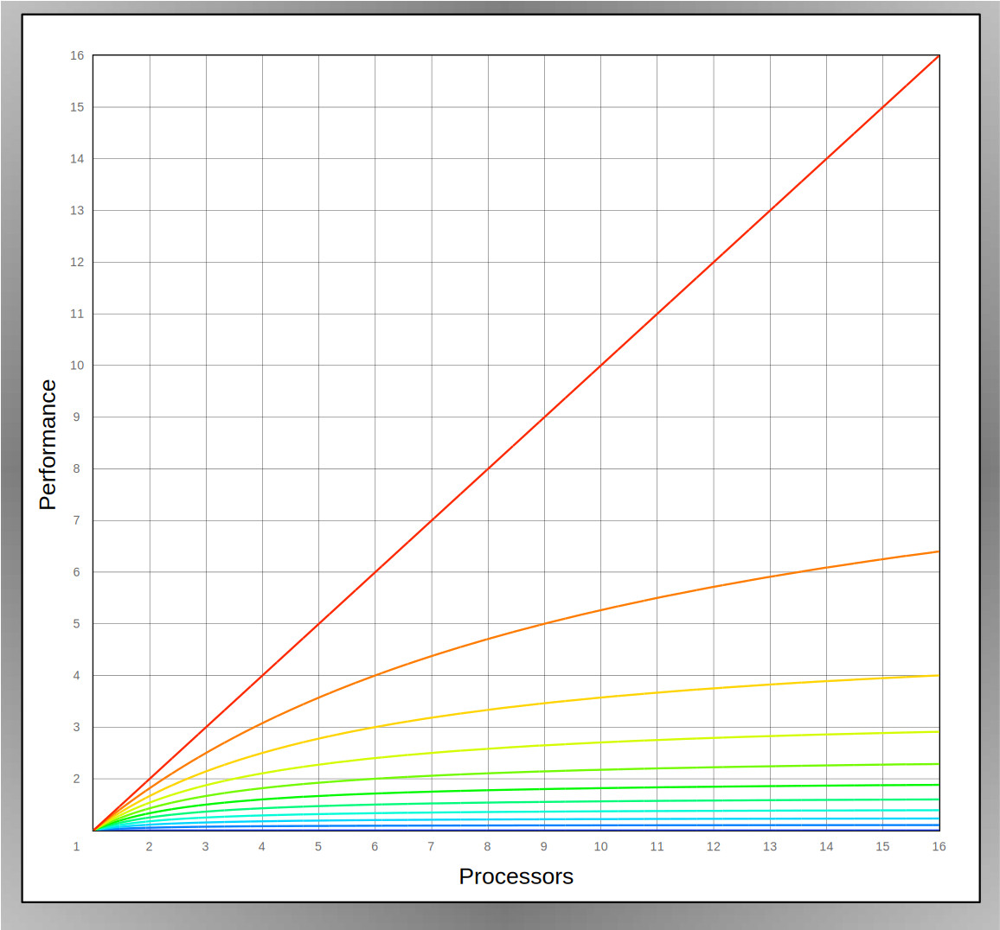

---
jupyter:
  jupytext:
    text_representation:
      extension: .md
      format_name: markdown
      format_version: '1.3'
      jupytext_version: 1.14.4
  kernelspec:
    display_name: C++17
    language: C++17
    name: xcpp17
---

<!-- #region slideshow={"slide_type": "slide"} tags=[] -->
# Concurrency

**Goal: No _raw_ synchronization**

## Definitions

> _Concurrency_ is when tasks start, run, and complete in overlapping time periods

> _Parallelism_ is when two or more tasks execute simultaneously

- Threads enable concurrency
- Processor cores enable parallelism
<!-- #endregion -->

<!-- #region slideshow={"slide_type": "slide"} tags=[] -->
## Motivation

- Better performance can be achieved through parallelism
- Better interactivity, and reduced latency, can be achieved through concurrency
<!-- #endregion -->

<!-- #region slideshow={"slide_type": "slide"} tags=[] -->

    
     
    <em>GFlops in the machine</em>

<!-- #endregion -->

<!-- #region slideshow={"slide_type": "slide"} tags=[] -->
## Challenge

_Amdahl's Law_ provides an equation that limits the expected speedup based on how much of an application is serialized.

$$ S_{latency}(s) = { 1 \over{(1 - p) + {p \over{s}}}} $$

Where:
- $S_{latency}$ is the theoretical speedup of the execution of the whole task;
- $s$ is the speedup of the part of the task that benefits from improved system resources;
- $p$ is the proportion of execution time that the part benefiting from improved resources originally occupied.

Amdahl's Law tells us the limit we can speed up any application is bounded by $1 \over{1 - p}$.

<!-- #endregion -->

<!-- #region slideshow={"slide_type": "slide"} tags=[] -->

    
     
    <em>Amdahl's Law</em>  
    <small>&mdash; By <a href="https://en.wikipedia.org/wiki/User:Daniels220" class="extiw" title="wikipedia:User:Daniels220">Daniels220</a> at <a href="https://en.wikipedia.org/wiki/" class="extiw" title="wikipedia:">English Wikipedia</a>, <a href="https://creativecommons.org/licenses/by-sa/3.0" title="Creative Commons Attribution-Share Alike 3.0">CC BY-SA 3.0</a>, <a href="https://commons.wikimedia.org/w/index.php?curid=6678551">Link</a></small>

<!-- #endregion -->

<!-- #region slideshow={"slide_type": "slide"} tags=[] -->

    
     
    <em>Amdahl's Law, Linear Scale</em> 
    Each line represents 10% more synchronization

<!-- #endregion -->

<!-- #region slideshow={"slide_type": "slide"} tags=[] -->
## Synchronization Primitives

- Atomics
- Mutex
- Lock
- Condition Variable
- Semaphore
- Memory Fence
<!-- #endregion -->

- All of these are explicit synchronization points
- All run the risk of misuse causing _race_ errors or deadlocks

<!-- #region slideshow={"slide_type": "skip"} tags=[] -->
_\[The following cell is an iframe for an [ithare infographic](http://ithare.com/infographics-operation-costs-in-cpu-clock-cycles/)\]_
<!-- #endregion -->

<!-- #region slideshow={"slide_type": "slide"} tags=[] -->
<section>
<iframe data-src='http://ithare.com/infographics-operation-costs-in-cpu-clock-cycles/'></iframe>
</section>
<!-- #endregion -->
