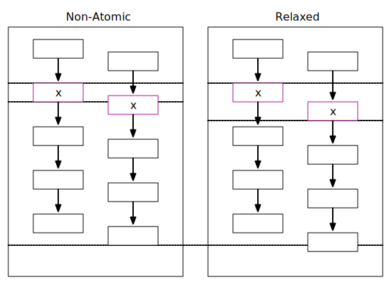
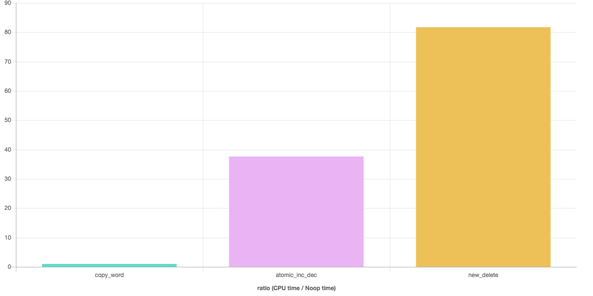

---
jupyter:
  jupytext:
    text_representation:
      extension: .md
      format_name: markdown
      format_version: '1.3'
      jupytext_version: 1.14.4
  kernelspec:
    display_name: C++17
    language: C++17
    name: xcpp17
---

<!-- #region slideshow={"slide_type": "slide"} -->
# The C++ Memory Model

## Basics

- Memory consists of one or more contiguous sequence of bytes
- Every byte has a unique address.
    - Bytes are >= 8 bits
<!-- #endregion -->

<!-- #region slideshow={"slide_type": "slide"} -->
## Processor Memory Hierarchy

<!-- #endregion -->

<!-- #region slideshow={"slide_type": "slide"} -->
## Threads and Data Races

- All objects are accessible to all threads
- When an evaluation of an expression writes to a memory location
    - and another evaluation reads or modifies the same memory location
    - the expressions _conflict_ and there is a _data race_ unless
        - both evaluations are on the same thread or same signal handler
        - both are atomic operations
        - one _happens-before_ another
    - if a data race occurs the behavior of the program is undefined
<!-- #endregion -->

<!-- #region slideshow={"slide_type": "slide"} -->
## Memory Order

- Memory order specifies how regular, non-atomic, memory accesses are to be ordered **around an atomic operation**
- Absent any constraints, one thread can observe the values changed by another thread in any order
- The default order for any standard library atomic operation is _sequentially-consistent_ (seq_cst)

<!-- #endregion -->

<!-- #region slideshow={"slide_type": "slide"} -->
## Other Supported Memory Orders

- Relaxed: there is no synchronization or ordering constraints imposed on _other_ reads or writes, only the operation's atomicity is guaranteed
<!-- #endregion -->

<!-- #region slideshow={"slide_type": "slide"} -->

<!-- #endregion -->

<!-- #region slideshow={"slide_type": "slide"} -->
- Acquire: applies to a load operation
    - no reads or writes in the current thread can be reordered before the load
- Release: applies to a store operation
    - no reads or writes in the current thread can be reordered after the store
    - all writes are visible in other threads that acquire the same atomic
    - all writes with a data dependency are visible in other threads that consume the same atomic
- Acquire-Release: applies to read-modify-write operations
    - Same guarantees as acquire and release for a single atomic operation
<!-- #endregion -->

<!-- #region slideshow={"slide_type": "slide"} -->

<!-- #endregion -->

<!-- #region slideshow={"slide_type": "slide"} -->
- Consume: (discouraged as of C++17) similar to aquire but only applies to dependent operations
    - no known production compiler tracks dependency chains - consume becomes aquire
<!-- #endregion -->

<!-- #region slideshow={"slide_type": "slide"} -->
## Sequentially Consistent Ordering

- load operations are acquire
- store operations are a release
- read-modify-write are acquire and release
- **a single total order exists in which all threads observe all modifications in the same order**
<!-- #endregion -->

<!-- #region slideshow={"slide_type": "slide"} -->
## Important

- Intel hardware has a _strong_ memory model
    - Every machine instruction has an implied acquire-release semantics
    - That _does not_ imply that every operation is atomic
    - And without specifying a memory order, the compiler is free to reorder operations
    - Peformance of memory-order relaxed and sequentially-consistent has no _hardware_ implications
<!-- #endregion -->

<!-- #region slideshow={"slide_type": "slide"} -->

    <a style="text-align:center" href="http://quick-bench.com/p13s_cSQ0JTeMUGcttdS1EFHVcE">Cost of Copy</a>

<!-- #endregion -->

<!-- #region slideshow={"slide_type": "slide"} -->
- ARM has a _weak_ memory model
    - Every operation is a consume or release
    - But without specifying a memory order, the compiler is free to reorder operations
<!-- #endregion -->

<!-- #region slideshow={"slide_type": "slide"} -->
## Recommendations

- Avoid using primitive synchronization mechanisms at all
- If you must, only use **sequentially consistent** ordering unless
    - You can demonstrate a performance gain
    - You can _prove_ it is correct
    - You have at least one other expert review your proof
    - You write a complete description along with your proof and include it in the code
    - You include a unit test to demonstrate both correctness and gain
<!-- #endregion -->
