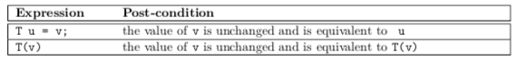

---
jupyter:
  jupytext:
    text_representation:
      extension: .md
      format_name: markdown
      format_version: '1.3'
      jupytext_version: 1.14.4
  kernelspec:
    display_name: C++17
    language: C++17
    name: xcpp17
---

```c++ slideshow={"slide_type": "skip"}
#include "../common.hpp"
```

<!-- #region slideshow={"slide_type": "slide"} -->
## Introduction
- The take home QE test:
    - Write a unit test, using Catch2 (a single-header C++ test framework) for `std::vector<>`.
<!-- #endregion -->

<!-- #region slideshow={"slide_type": "fragment"} -->
- IMO this is a bad problem
    - As we will see, this is a significant project in scale
    - The Catch2 docs use `vector<>` in their examples, badly
    - `vector<>` is very well specified, most APIs are not
    - Writing good tests requires some knowledge of the implementation
    - `vector<>` has been very well vetted, so it is extremely unlikely the candidate will find a bug
<!-- #endregion -->

<!-- #region slideshow={"slide_type": "fragment"} -->
- I've been surprised by the results
<!-- #endregion -->

<!-- #region slideshow={"slide_type": "slide"} -->
- _Disclaimers_
<!-- #endregion -->

<!-- #region slideshow={"slide_type": "slide"} -->
- The usual approach to writing tests is:
    - Make sure every operation is called once
    - Check an attribute of the post-condition
    - Add additional tests until 100% code coverage is obtained
<!-- #endregion -->

<!-- #region slideshow={"slide_type": "fragment"} -->
- This approach will usually only catch trivial mistakes
    - It is unlikely to catch edge cases or design errors
<!-- #endregion -->

<!-- #region slideshow={"slide_type": "slide"} -->
- During this course section we will be developing an approach to test `std::vector<>`
    - To simplify the problem we will be only be testing with the default allocator
    - We will also ignore the `std::vector<bool>` specialization
<!-- #endregion -->

<!-- #region slideshow={"slide_type": "slide"} -->
## Why test?

### Preliminaries
<!-- #endregion -->

<!-- #region slideshow={"slide_type": "fragment"} -->
- To improve the probability the code is _correct_
<!-- #endregion -->

<!-- #region slideshow={"slide_type": "fragment"} -->
- But what is _correct_?
<!-- #endregion -->

<!-- #region slideshow={"slide_type": "fragment"} -->
- Correct is logically consistent, without _contradiction_
<!-- #endregion -->

<!-- #region slideshow={"slide_type": "fragment"} -->
- For software to be correct it has to mean something
    - What does `0100` mean?
<!-- #endregion -->

<!-- #region slideshow={"slide_type": "slide"} -->
- For objects to have meaning they must correspond to an _entity_, either concrete or abstract
```cpp
void f() {
    int i; // the value of i has no meaning
}
```
<!-- #endregion -->

<!-- #region slideshow={"slide_type": "fragment"} -->
- Two objects are _equal_ iff their values correspond to the same entity
- From this definition of equality we can derive the following properties
<!-- #endregion -->

<!-- #region slideshow={"slide_type": "fragment"} -->
\begin{align}
(\forall a) a &= a.\tag{Reflexivity} \\
(\forall a, b) a &= b \implies b = a.\tag{Symmetry} \\
(\forall a, b, c) a &= b \wedge b = c \implies a = c.\tag{Transitivity}
\end{align}
<!-- #endregion -->

<!-- #region slideshow={"slide_type": "slide"} -->
### History
<!-- #endregion -->

<!-- #region slideshow={"slide_type": "fragment"} -->
- _Double-entry bookkeeping_ was pioneered in the 11th century by Jewish banking community
    - and likely developed independently in Korea in the same time period
- In the late 13th century it spread to Italy
- In the 14th century double-entry bookkeeping was adopted by the Medici bank
    - And is credited with establishing the Medici bank as reliable and trustworthy, leading to the rise of one of the most powerful family dynasties in history
- Was codified by Luca Pacioli (the Father of Accounting) in 1494
<!-- #endregion -->

<!-- #region slideshow={"slide_type": "slide"} -->
- Double-entry bookkeeping is a tool for error detection and fraud prevention
- It relies on the accounting equation:
$$assets = liabilities + equity$$
- And is an example of _equational reasoning_
<!-- #endregion -->

<!-- #region slideshow={"slide_type": "fragment"} -->
- By ensuring that all transactions are made against two separate accounts
    - The probability of error is significantly reduced
        - Not eliminated
    - And the account gains _transparency_ making it easier to _audit_ and detect fraud
<!-- #endregion -->

<!-- #region slideshow={"slide_type": "slide"} -->
### Principals of Testing
- _Testing_ is applying the principals of double-entry bookkeeping to engineering
- State each operation in two _independent but equivalent_ forms
    - Where possible, state an operation in terms of the _axioms_ that define it
- Test for equivalency and flag any contradictions
<!-- #endregion -->

<!-- #region slideshow={"slide_type": "fragment"} -->
- A contradiction does not imply the code being tested is wrong
    - The test case is at least as likely to be incorrect
    - A failed test only implies _something_ is inconsistent
<!-- #endregion -->

<!-- #region slideshow={"slide_type": "slide"} -->
### First Test
<!-- #endregion -->

<!-- #region slideshow={"slide_type": "fragment"} -->
- Our tests will largely be based on what equality means
    - So we start our test with making sure equality is correct
- `vector` is a container, the standard includes a table of the container requirements:
<!-- #endregion -->

<!-- #region slideshow={"slide_type": "slide"} -->

<!-- #endregion -->

<!-- #region slideshow={"slide_type": "slide"} -->

<!-- #endregion -->

```c++ slideshow={"slide_type": "slide"}
template <class T>
void test_equality_1(const T& a, const T& b, const T& c) {
    REQUIRE(a == a);                          // Reflexivity
    REQUIRE(!(a == b) || (b == a));           // Symmetry
    REQUIRE(!(a == b && b == c) || (a == c)); // Transitivity
}
```

```c++ slideshow={"slide_type": "fragment"}
{
    vector<int> a, b, c;
    test_equality_1(a, b, c);
}
```

<!-- #region slideshow={"slide_type": "slide"} -->
- There are at least two problems with this test
    - It ignores the universal quantifier, $\forall$
    - It is trivially satisfiable
        - `operator==()` could always return true
<!-- #endregion -->

<!-- #region slideshow={"slide_type": "fragment"} -->
- It isn't practical, or even possible, to test universal quantifiers
    - Instead we need to choose _representative values_
<!-- #endregion -->

<!-- #region slideshow={"slide_type": "slide"} -->

<!-- #endregion -->

<!-- #region slideshow={"slide_type": "fragment"} -->
- size (zero, not-zero, different)
- capacity (equal size, greater size, different)
- values (equal, initial equal, different)
<!-- #endregion -->

```c++ slideshow={"slide_type": "slide"}
template <class T>
auto make_vector(initializer_list<T> init, std::size_t additional_capacity) {
    vector<T> r;
    r.reserve(size(init) + additional_capacity);
    r.insert(end(r), init);
    return r;
}
```

<!-- #region slideshow={"slide_type": "slide"} -->
- Create an array of pairs tags and representative values
    - Values with the same tag, and only values with the same tag, must be equal
<!-- #endregion -->

```c++ slideshow={"slide_type": "fragment"}
struct {
    int tag;
    std::vector<int> value;
} vec_rep[]{
    {0, make_vector<int>({}, 0)}, {0, make_vector<int>({}, 1)},
    {0, make_vector<int>({}, 2)},

    {1, make_vector({0}, 0)},     {1, make_vector({0}, 1)},
    {1, make_vector({0}, 2)},

    {2, make_vector({0, 1}, 0)},  {2, make_vector({0, 1}, 0)},
    {2, make_vector({0, 1}, 0)},

    {3, make_vector({0, 2}, 0)},  {3, make_vector({0, 2}, 0)},
    {3, make_vector({0, 2}, 0)},

    {4, make_vector({1, 2}, 0)},  {4, make_vector({1, 2}, 0)},
    {4, make_vector({1, 2}, 0)},
};
```

```c++ slideshow={"slide_type": "slide"}
template <class T>
void test_equality_2(const T& a) {
    // Reflexivity
    for (const auto& e : a)
        REQUIRE(e.value == e.value);

    // Symmetry
    for_each_k_combination<2>(a, [](const auto& a, const auto& b) {
        REQUIRE((a.tag == b.tag) == (a.value == b.value));
        REQUIRE((a.tag == b.tag) == (b.value == a.value));
    });

    // Transitivity
    for_each_k_combination<3>(a, [](const auto& a, const auto& b, const auto& c) {
        REQUIRE(!(a.value == b.value && b.value == c.value) ||
                (a.value == c.value));
    });
}
```

```c++ slideshow={"slide_type": "slide"}
{
    test_equality_2(vec_rep);
}
```

<!-- #region slideshow={"slide_type": "slide"} -->
- Side notes
    - Is the test for transitivity redundant?
        - All pair value combinations are equal to the equivalency of tags
        - Tag comparisons are transitive
        - Therefore value comparisons are transitive
    - `for_each_k_combination<>` is an interesting algorithm (implementation in my notes)
<!-- #endregion -->

```c++ slideshow={"slide_type": "slide"}
{
    int a[] = {0, 1, 2, 3, 4};
    for_each_k_combination<3>(a, [](int a, int b, int c){
        cout << a << "," << b << "," << c << endl;
    });
}
```

<!-- #region slideshow={"slide_type": "slide"} -->
- Knowing `operator==()` is correct we can test operator `operator!=()` easily
<!-- #endregion -->

```c++ slideshow={"slide_type": "fragment"}
template <class T>
void test_inequality_1(const T& a) {
    for_each_k_combination<2>(a, [](const auto& a, const auto& b){
        REQUIRE(!(a.value == b.value) == (a.value != b.value));
        REQUIRE(!(a.value == b.value) == (b.value != a.value));
    });
}
```

```c++ slideshow={"slide_type": "fragment"}
{
    test_inequality_1(vec_rep);
}
```

<!-- #region slideshow={"slide_type": "slide"} -->
### Copy & Assignment
- Copy & Assignment are defined in term of equality
<!-- #endregion -->

<!-- #region slideshow={"slide_type": "fragment"} -->
Let $m()$ be an an action that modifies its argument such that given $a = b$, $m(a) \implies a \not= b.$

\begin{align}
a \rightarrow b &\implies a = b. \tag{Equal} \\
\text{Let } a = c  \text{. } a \rightarrow b \text{, } m(a) &\implies a \not = b \wedge b = c. \tag{Disjoint}
\end{align}
<!-- #endregion -->

<!-- #region slideshow={"slide_type": "fragment"} -->
See [_Fundamentals of Generic Programming_](http://stepanovpapers.com/DeSt98.pdf)
<!-- #endregion -->

<!-- #region slideshow={"slide_type": "slide"} -->


<!-- #endregion -->

<!-- #region slideshow={"slide_type": "slide"} -->


<!-- #endregion -->

<!-- #region slideshow={"slide_type": "slide"} -->
- Notice anything missing?
<!-- #endregion -->

<!-- #region slideshow={"slide_type": "slide"} -->
- Nothing I can find in the C++ standard precludes aliased copies, i.e.
```cpp
vector<int> a;
vector<int> b = a;
a.push_back(42);
assert(b.back() == 42);
```
<!-- #endregion -->

<!-- #region slideshow={"slide_type": "fragment"} -->
- Except for breaking-all-the-code there is no disjoint requirement
    - Eric Niebler, Stephan T. Lavavej, and Howard Hinnant agree
<!-- #endregion -->

```c++ slideshow={"slide_type": "slide"}
template <class T>
void test_copy_and_assignment_1(const T& v) {
    for (const auto& a : v) {
        {
            decltype(a.value) b = a.value; // copy construct
            REQUIRE(a.value == b);
        }
        {
            decltype(a.value) b; // default construct
            b = a.value;         // assignment
            REQUIRE(a.value == b);
        }
    }
}
```

```c++ slideshow={"slide_type": "fragment"}
{
    test_copy_and_assignment_1(vec_rep);
}
```

<!-- #region slideshow={"slide_type": "slide"} -->
- Only checking the first axiom
- The assignment check is always assigning to a default constructed object
    - This might mask a leak
- Self assignment is not checked
    - A common failure case
- No complexity test
- No failure tests
<!-- #endregion -->

<!-- #region slideshow={"slide_type": "fragment"} -->
- Also, what is the behavior if there is sufficient capacity for the left value of assignment?
<!-- #endregion -->

<!-- #region slideshow={"slide_type": "slide"} -->

<!-- #endregion -->

<!-- #region slideshow={"slide_type": "slide"} -->
- I do not believe this behavior is currently specified
<!-- #endregion -->

```c++ slideshow={"slide_type": "slide"}
std::vector<int> vec_rep_2[]{
    make_vector<int>({}, 0),
    make_vector<int>({}, 1),
    make_vector<int>({}, 2),
    make_vector({0}, 0),
    make_vector({0}, 1),
    make_vector({0}, 2),
    make_vector({0, 1}, 0),
    make_vector({0, 2}, 0),
    make_vector({1, 2}, 0)
};
```

```c++ slideshow={"slide_type": "fragment"}
template <class T>
void modify(vector<T>& a) {
    a.push_back(T{});
}
```

```c++ slideshow={"slide_type": "slide"}
template <class T>
void test_copy_and_assignment_2(const T& v) {
    for (const auto& a : v) {
        decltype(a) b = a;        // copy construct
        REQUIRE(a == b);          // copies are equal
        b = b;                    // self assignment
        REQUIRE(a == b);          // self assignment is a no-op
        modify(b);
        REQUIRE(a != b);          // copies are disjoint
    }
    for (const auto& a : v) {
        for (const auto& c : v) {
            decltype(a) b = a;    // make a copy
            b = c;                // copy assignment
            REQUIRE(b == c);      // copies ar equal
            modify(b);
            REQUIRE(b != c);      // copies are disjoint
        }
    }
}
```

<!-- #region slideshow={"slide_type": "fragment"} -->
- We are still missing complexity and failure cases...
<!-- #endregion -->

<!-- #region slideshow={"slide_type": "slide"} -->
### Homework
- Read the C++ specification for `vector`: http://www.open-std.org/jtc1/sc22/wg21/docs/papers/2017/n4713.pdf
    - When you come across terms like `Container` and `EqualityComparable` look those up as well
- Create a class with an `operato==()` which fails in various ways and test it
    - Implementation of `for_each_k_combination<>` is available here https://github.com/sean-parent/notebook/blob/master/common.hpp
- Can you create an `vector<T>` where `T` is not `EqualityComparable`?
    - Consider how to test such an instance
<!-- #endregion -->
