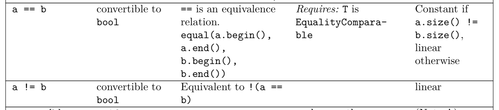
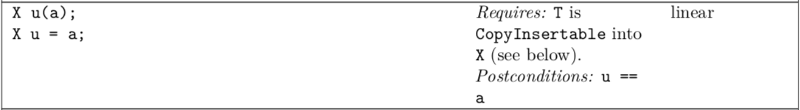

---
jupyter:
  jupytext:
    text_representation:
      extension: .md
      format_name: markdown
      format_version: '1.3'
      jupytext_version: 1.14.4
  kernelspec:
    display_name: C++17
    language: C++17
    name: xcpp17
---

```c++ slideshow={"slide_type": "skip"}
#include "../common.hpp"
```

<!-- #region slideshow={"slide_type": "slide"} -->
# Complexity, Failure, & Optional Operations
## Revisiting Equality
<!-- #endregion -->

```c++ slideshow={"slide_type": "fragment"}
template <class T>
void test_equality_3(const T& a) {
    // Reflexivity
    for (const auto& e : a)
        REQUIRE(e.value == e.value);

    // Symmetry
    for_each_k_combination<2>(a, [](const auto& a, const auto& b) {
        REQUIRE((a.tag == b.tag) == (a.value == b.value));
        REQUIRE((a.tag == b.tag) == (b.value == a.value));
    });

    // Transitivity (implied by symmetry test)
}
```

```c++ slideshow={"slide_type": "skip"}
template <class T>
auto make_vector(initializer_list<T> init, std::size_t additional_capacity) {
    vector<T> r;
    r.reserve(size(init) + additional_capacity);
    r.insert(end(r), init);
    return r;
}
```

```c++ slideshow={"slide_type": "skip"}
struct {
    int tag;
    std::vector<int> value;
} vec_rep[]{
    {0, make_vector<int>({}, 0)}, {0, make_vector<int>({}, 1)},
    {0, make_vector<int>({}, 2)},

    {1, make_vector({0}, 0)},     {1, make_vector({0}, 1)},
    {1, make_vector({0}, 2)},

    {2, make_vector({0, 1}, 0)},  {2, make_vector({0, 1}, 0)},
    {2, make_vector({0, 1}, 0)},

    {3, make_vector({0, 2}, 0)},  {3, make_vector({0, 2}, 0)},
    {3, make_vector({0, 2}, 0)},

    {4, make_vector({1, 2}, 0)},  {4, make_vector({1, 2}, 0)},
    {4, make_vector({1, 2}, 0)},
};
```

```c++ slideshow={"slide_type": "slide"}
{
    test_equality_3(vec_rep);
}
```

<!-- #region slideshow={"slide_type": "slide"} -->
### Complexity
<!-- #endregion -->

<!-- #region slideshow={"slide_type": "slide"} -->

<!-- #endregion -->

<!-- #region slideshow={"slide_type": "slide"} -->
- It is difficult to test complexity by measuring performance
<!-- #endregion -->

<!-- #region slideshow={"slide_type": "fragment"} -->
\begin{align}
performance \neq complexity
\end{align}
<!-- #endregion -->

<!-- #region slideshow={"slide_type": "fragment"} -->
- Complexity is a measure of the number of operations executed
<!-- #endregion -->

<!-- #region slideshow={"slide_type": "fragment"} -->
\begin{align}
complexity \approx performance
\end{align}
<!-- #endregion -->

<!-- #region slideshow={"slide_type": "fragment"} -->
- For $complexity = performance$ all operations must execute in the same, constant, time
    - Irrespective of cache, compiler optimizations, and processor load
<!-- #endregion -->

<!-- #region slideshow={"slide_type": "fragment"} -->
- To test complexity, count operations
<!-- #endregion -->

```c++ slideshow={"slide_type": "slide"}
namespace {

static size_t _equality;

struct instrumented_1 {
    int _value{0};

    instrumented_1(int value) : _value(value) {}

    friend inline bool operator==(const instrumented_1& x, const instrumented_1& y) {
        ++_equality;
        return x._value == y._value;
    }
};

}
```

```c++ slideshow={"slide_type": "slide"}
template <class F>
void expect_equality(const F& f, size_t max) {
    size_t initial = _equality;
    f();
    REQUIRE((_equality - initial) <= max);
}
```

```c++ slideshow={"slide_type": "slide"}
template <class T>
void test_equality_4(const T& a) {
    // Reflexivity
    for (const auto& e : a) {
        expect_equality([&] { REQUIRE(e.value == e.value); }, e.value.size());
    }

    // Symmetry
    for_each_k_combination<2>(a, [&](const auto& a, const auto& b) {
        expect_equality([&] { REQUIRE((a.tag == b.tag) == (a.value == b.value)); },
                        ((a.value.size() != b.value.size()) ? 0 : a.value.size()));

        expect_equality([&] { REQUIRE((a.tag == b.tag) == (b.value == a.value)); },
                        ((a.value.size() != b.value.size()) ? 0 : a.value.size()));
    });

    // Transitivity (implied by symmetry test)
}
```

```c++ slideshow={"slide_type": "slide"}
struct {
    int tag;
    std::vector<instrumented_1> value;
} vec_rep_1[]{
    {0, make_vector<instrumented_1>({}, 0)},
    {0, make_vector<instrumented_1>({}, 1)},
    {0, make_vector<instrumented_1>({}, 2)},

    {1, make_vector<instrumented_1>({0}, 0)},
    {1, make_vector<instrumented_1>({0}, 1)},
    {1, make_vector<instrumented_1>({0}, 2)},

    {2, make_vector<instrumented_1>({{0}, {1}}, 0)},
    {2, make_vector<instrumented_1>({{0}, {1}}, 0)},

    {3, make_vector<instrumented_1>({{0}, {2}}, 0)},
    {3, make_vector<instrumented_1>({{0}, {2}}, 0)},

    {4, make_vector<instrumented_1>({{1}, {2}}, 0)},
    {4, make_vector<instrumented_1>({{1}, {2}}, 0)},
};
```

```c++ slideshow={"slide_type": "slide"}
{
    test_equality_4(vec_rep_1);
}
```

<!-- #region slideshow={"slide_type": "slide"} -->
## Revisiting Copy and Assignment
<!-- #endregion -->

<!-- #region slideshow={"slide_type": "fragment"} -->
> **Exercise 2.1**  Add a counter to `instrumented_1` for copy and a test case for copy and assignment complexity.
<!-- #endregion -->

<!-- #region slideshow={"slide_type": "slide"} -->
### Exception During Copy and Assignment
<!-- #endregion -->

<!-- #region slideshow={"slide_type": "fragment"} -->
- Should we test the behavior when an exception is thrown copying or assigning a `vector`?
<!-- #endregion -->

<!-- #region slideshow={"slide_type": "fragment"} -->
- There are two possible points of failure:
    - Allocating memory for the `vector`
    - Copying the objects in the `vector`
        - Most likely because of a memory allocation failure
<!-- #endregion -->

<!-- #region slideshow={"slide_type": "slide"} -->
- Out-of-memory, OOM, rarely actually results in a `bad_alloc` exception
    - The OS behavior of out-of-memory, OOM, cannot be relied upon
    - MacOS, and Linux (and Android) over-commit
        - Exhausting virtual memory suspends or kills the application
        - A `bad_alloc` is only possible in 32 bit mode (deprecated MacOS) by exhausting the address space
     - iOS also over-commits
         - But there is no backing store
         - Exhausting physical memory kills the application
<!-- #endregion -->

<!-- #region slideshow={"slide_type": "fragment"} -->
- Most OOM recovery code is untested
    - likely to fail
    - and a possible security risk
- Platform calls are likely not to handle memory failures
<!-- #endregion -->

<!-- #region slideshow={"slide_type": "slide"} -->
- Herb Sutter has put forth a proposal to migrate away from exceptions to signal out-of-memory, and simply terminate the app is such circumstances, this may make it into C++20 or a TS in the C++20 time frame
    - [Zero-overhead deterministic exceptions: Throwing values](http://www.open-std.org/jtc1/sc22/wg21/docs/papers/2018/p0709r1.pdf)
<!-- #endregion -->

<!-- #region slideshow={"slide_type": "fragment"} -->
- I'm cautiously in favor of this proposal
<!-- #endregion -->

<!-- #region slideshow={"slide_type": "slide"} -->
- There are several scenarios where `vector` or `T` could still throw on copy
    - When using a custom allocator which limits resources
    - When using replacement operator new / delete which limit resources
        - (This may be disallowed by the above proposal.)
    - When the copying `T` throws for a reason other tham OOM
        - (Though it is dificult to give a non-contrived example.)
<!-- #endregion -->

<!-- #region slideshow={"slide_type": "fragment"} -->
- Jupyter doesn't allow me to replace `operator new` and `operator delete`
    - But typically you could use these to test failures with allocations
<!-- #endregion -->

```c++ slideshow={"slide_type": "slide"}
size_t _allocate{0};
size_t _deallocate{0};
size_t _allocate_limit{numeric_limits<size_t>::max()};
```

```c++ slideshow={"slide_type": "slide"}
template <class T>
struct test_allocator {
    using value_type = T;

    test_allocator() = default;

    template <class U>
    constexpr test_allocator(const test_allocator<U>&) noexcept {}

    [[nodiscard]] T* allocate(size_t n) {
        if (_allocate == _allocate_limit) throw bad_alloc();
        if (n > (numeric_limits<size_t>::max() / sizeof(T))) throw bad_alloc();
        auto result = static_cast<T*>(::operator new(n * sizeof(T)));
        ++_allocate;
        return result;
    }

    void deallocate(T* p, size_t n) noexcept {
        ::operator delete(p /*, n */); // gcc doesn't yet support delete with size
        ++_deallocate;
    }

    friend bool operator==(const test_allocator&, const test_allocator&) { return true; }
    friend bool operator!=(const test_allocator&, const test_allocator&) { return false; }
};
```

```c++ slideshow={"slide_type": "slide"}
template <class T>
auto make_vector_2(initializer_list<T> init, std::size_t additional_capacity) {
    vector<T, test_allocator<T>> r;
    r.reserve(size(init) + additional_capacity);
    r.insert(end(r), init);
    return r;
}
```

```c++ slideshow={"slide_type": "slide"}
std::vector<int, test_allocator<int>> vec_rep_2[]{
    make_vector_2<int>({}, 0), make_vector_2<int>({}, 1), make_vector_2<int>({}, 2),
    make_vector_2({0}, 0),     make_vector_2({0}, 1),     make_vector_2({0}, 2),
    make_vector_2({0, 1}, 0),  make_vector_2({0, 2}, 0),  make_vector_2({1, 2}, 0)};
```

```c++ slideshow={"slide_type": "skip"}
template <class T>
void modify(vector<T>& a) {
    a.push_back(T{});
}
```

```c++ slideshow={"slide_type": "slide"}
template <class T>
void test_copy_and_assignment_2(const T& v) {
    for (const auto& a : v) {
        decay_t<decltype(a)> b = a; // copy construct
        REQUIRE(a == b);            // copies are equal
        b = b;                      // self assignment
        REQUIRE(a == b);            // self assignment is a no-op
        modify(b);
        REQUIRE(a != b);            // copies are disjoint
    }
    for (const auto& a : v) {
        for (const auto& c : v) {
            decay_t<decltype(a)> b = a; // make a copy
            b = c;                      // copy assignment
            REQUIRE(b == c);            // copies ar equal
            modify(b);
            REQUIRE(b != c);            // copies are disjoint
        }
    }
}
```

```c++ slideshow={"slide_type": "slide"}
template <class F>
size_t allocation_count(const F& f) {
    auto initial = _allocate;
    f();
    return _allocate - initial;
}

template <class F>
void allocation_failure(const F& f, size_t i) {
    auto limit = _allocate + i;
    swap(limit, _allocate_limit);

    auto initial = _allocate - _deallocate;
    bool failed = false;

    try {
        f();
    } catch (bad_alloc&) {
        failed = true;
    }
    swap(limit, _allocate_limit);
    REQUIRE(failed && (initial == (_allocate - _deallocate)));
}
```

```c++ slideshow={"slide_type": "slide"}
template <class T>
void test_copy_and_assignment_failure(const T& v) {
    for (const auto& a : v) {
        for (const auto& c : v) {
            auto n = allocation_count([&] {
                decay_t<decltype(a)> b = a; // copy construct
                b = c;                      // copy assignment
            });

            for (size_t i = 0; i != n; ++i) {
                allocation_failure(
                    [&] {
                        decay_t<decltype(a)> b = a; // copy construct
                        b = c;                      // copy assignment
                    },
                    i);
            }
        }
    }
}
```

```c++ slideshow={"slide_type": "slide"}
{
    test_copy_and_assignment_failure(vec_rep_2);
}
```

<!-- #region slideshow={"slide_type": "slide"} -->
> **Exercise 2.2**  Add a `_copy_limit` to `instrumented_1` from _exercise 2.1_ and add a destructor counter. Extend the above test to ensure the all `instrumented_1` objects are correctely destructed in the event of an exception from the allocator or from copying the `instrumented_1` object.
<!-- #endregion -->

<!-- #region slideshow={"slide_type": "slide"} -->
### Optional Move/Copy Operations
<!-- #endregion -->

<!-- #region slideshow={"slide_type": "slide"} -->

<!-- #endregion -->

<!-- #region slideshow={"slide_type": "slide"} -->

<!-- #endregion -->

<!-- #region slideshow={"slide_type": "slide"} -->
- "Requires" in this context means that the concept is required for _this_ operation
    - Not for a `vector` in general
<!-- #endregion -->

```c++ slideshow={"slide_type": "fragment"}
{
    vector<unique_ptr<int>> a;
    vector<unique_ptr<int>> b;
}
```

<!-- #region slideshow={"slide_type": "fragment"} -->
```cpp
{
    vector<unique_ptr<int>> a;
    vector<unique_ptr<int>> b = a;
}
```
<!-- #endregion -->

<!-- #region slideshow={"slide_type": "fragment"} -->
```
In file included from input_line_5:1:
In file included from /Users/sean-parent/miniconda3/envs/notebook/include/xeus/xinterpreter.hpp:12:
In file included from /Users/sean-parent/miniconda3/envs/notebook/include/c++/v1/functional:487:
/Users/sean-parent/miniconda3/envs/notebook/include/c++/v1/memory:1759:31: error: call to implicitly-deleted copy constructor of 'std::__1::unique_ptr<int, std::__1::default_delete<int> >'
            ::new((void*)__p) _Up(_VSTD::forward<_Args>(__args)...);
                              ^   ~~~~~~~~~~~~~~~~~~~~~~~~~~~~~
/Users/sean-parent/miniconda3/envs/notebook/include/c++/v1/memory:1670:18: note: in instantiation of function template specialization 'std::__1::allocator<std::__1::unique_ptr<int,
      std::__1::default_delete<int> > >::construct<std::__1::unique_ptr<int, std::__1::default_delete<int> >,
      std::__1::unique_ptr<int, std::__1::default_delete<int> > &>' requested here
            {__a.construct(__p, _VSTD::forward<_Args>(__args)...);}
                 ^
/Users/sean-parent/miniconda3/envs/notebook/include/c++/v1/memory:1516:14: note: in instantiation of function template specialization
      'std::__1::allocator_traits<std::__1::allocator<std::__1::unique_ptr<int, std::__1::default_delete<int> > >
      >::__construct<std::__1::unique_ptr<int, std::__1::default_delete<int> >, std::__1::unique_ptr<int,
      std::__1::default_delete<int> > &>' requested here
            {__construct(__has_construct<allocator_type, _Tp*, _Args...>(),
             ^
/Users/sean-parent/miniconda3/envs/notebook/include/c++/v1/memory:1600:17: note: in instantiation of function template specialization
      'std::__1::allocator_traits<std::__1::allocator<std::__1::unique_ptr<int, std::__1::default_delete<int> > >
      >::construct<std::__1::unique_ptr<int, std::__1::default_delete<int> >, std::__1::unique_ptr<int,
      std::__1::default_delete<int> > &>' requested here
                construct(__a, _VSTD::__to_raw_pointer(__begin2), *__begin1);
                ^
/Users/sean-parent/miniconda3/envs/notebook/include/c++/v1/vector:1019:21: note: in instantiation of function template specialization
      'std::__1::allocator_traits<std::__1::allocator<std::__1::unique_ptr<int, std::__1::default_delete<int> > >
      >::__construct_range_forward<std::__1::unique_ptr<int, std::__1::default_delete<int> > *,
      std::__1::unique_ptr<int, std::__1::default_delete<int> > *>' requested here
    __alloc_traits::__construct_range_forward(__a, __first, __last, this->__end_);
                    ^
/Users/sean-parent/miniconda3/envs/notebook/include/c++/v1/vector:1202:9: note: in instantiation of function template specialization 'std::__1::vector<std::__1::unique_ptr<int,
      std::__1::default_delete<int> >, std::__1::allocator<std::__1::unique_ptr<int, std::__1::default_delete<int> >
      > >::__construct_at_end<std::__1::unique_ptr<int, std::__1::default_delete<int> > *>' requested here
        __construct_at_end(__x.__begin_, __x.__end_, __n);
        ^
input_line_29:4:33: note: in instantiation of member function 'std::__1::vector<std::__1::unique_ptr<int, std::__1::default_delete<int> >,
      std::__1::allocator<std::__1::unique_ptr<int, std::__1::default_delete<int> > > >::vector' requested here
    vector<unique_ptr<int>> b = a;
                                ^
/Users/sean-parent/miniconda3/envs/notebook/include/c++/v1/memory:2388:3: note: copy constructor is implicitly deleted because 'unique_ptr<int, std::__1::default_delete<int> >' has a user-declared
      move constructor
  unique_ptr(unique_ptr&& __u) noexcept
  ^
Interpreter Error:
```
<!-- #endregion -->

<!-- #region slideshow={"slide_type": "slide"} -->
- To make matters worse, we cannot test if `vector` is copyable or not
<!-- #endregion -->

```c++ slideshow={"slide_type": "fragment"}
{
    vector<unique_ptr<int>> a;
    cout << boolalpha << is_copy_constructible_v<decltype(a)> << endl;
}
```

<!-- #region slideshow={"slide_type": "slide"} -->
- This is because the copy-constructor for `vector` is declared, but it will fail to instanciate
    - There is currently no good way to SFINAE the a copy constructor
        - To "fix" this would require multiple specializations of `vector`
    - This is a defect in the language/library that _should_ be fixed with concepts

<!-- #endregion -->

<!-- #region slideshow={"slide_type": "-"} -->
```cpp
    vector(const vector&)
    requires is_copy_constructible_v<T>;
```
<!-- #endregion -->

<!-- #raw slideshow={"slide_type": "fragment"} -->
As of C++11, the only requirement on `T` is that it is _Erasable_ (Destructible)
<!-- #endraw -->

```c++ slideshow={"slide_type": "slide"}
{
    class useless {
    public:
        useless() = default;

        useless(const useless&) noexcept = delete;
        useless(useless&&) = delete;

        useless& operator=(const useless&) = delete;
        useless& operator=(useless&&) noexcept = delete;
    };

    vector<useless> a(3); // a few useless things!
}
```

<!-- #region slideshow={"slide_type": "slide"} -->
- Creating models for all permuations of operations would be prohibitive
    - Instead we can use static_asserts to ensure operations are not instanciated
<!-- #endregion -->

```c++ slideshow={"slide_type": "slide"}
namespace {

enum operations { copy_constructible = 1 << 0, equality_comparable = 1 << 1 };

template <operations Ops>
struct instrumented_2 {
    int _value{0};

    instrumented_2(int value) : _value(value) {}

    instrumented_2(const instrumented_2& x) : _value{x._value} {
        static_assert(Ops & copy_constructible);
    }

    friend inline bool operator==(const instrumented_2& x, const instrumented_2& y) {
        static_assert(Ops & equality_comparable);
        ++_equality;
        return x._value == y._value;
    }
};

} // namespace
```

```c++ slideshow={"slide_type": "slide"}
{

using instrumented_t = instrumented_2<copy_constructible>;

vector<instrumented_t> x;
x.push_back(instrumented_t(42));

}
```

<!-- #region slideshow={"slide_type": "slide"} -->
```cpp
{

using instrumented_t = instrumented_2<copy_constructible>;

vector<instrumented_t> a, b;

cout << (a == b) << endl;

}
```
<!-- #endregion -->

<!-- #region slideshow={"slide_type": "fragment"} -->
```
input_line_30:11:9: error: static_assert failed
        static_assert(Ops & equality_comparable);
        ^             ~~~~~~~~~~~~~~~~~~~~~~~~~
/Users/sean-parent/miniconda3/envs/notebook/include/c++/v1/algorithm:682:71: note: in instantiation of member function '(anonymous namespace)::operator==' requested here
    bool operator()(const _T1& __x, const _T1& __y) const {return __x == __y;}
                                                                      ^
/Users/sean-parent/miniconda3/envs/notebook/include/c++/v1/algorithm:1337:19: note: in instantiation of function template specialization 'std::__1::equal<std::__1::__wrap_iter<const (anonymous
      namespace)::instrumented_2<(anonymous namespace)::operations::copy_constructible> *>, std::__1::__wrap_iter<const
      (anonymous namespace)::instrumented_2<(anonymous namespace)::operations::copy_constructible> *>,
      std::__1::__equal_to<(anonymous namespace)::instrumented_2<(anonymous namespace)::operations::copy_constructible>,
      (anonymous namespace)::instrumented_2<(anonymous namespace)::operations::copy_constructible> > >' requested here
    return _VSTD::equal(__first1, __last1, __first2, __equal_to<__v1, __v2>());
                  ^
/Users/sean-parent/miniconda3/envs/notebook/include/c++/v1/vector:3301:41: note: in instantiation of function template specialization 'std::__1::equal<std::__1::__wrap_iter<const (anonymous
      namespace)::instrumented_2<(anonymous namespace)::operations::copy_constructible> *>, std::__1::__wrap_iter<const
      (anonymous namespace)::instrumented_2<(anonymous namespace)::operations::copy_constructible> *> >' requested here
    return __sz == __y.size() && _VSTD::equal(__x.begin(), __x.end(), __y.begin());
                                        ^
input_line_32:6:12: note: in instantiation of function template specialization 'std::__1::operator==<(anonymous
      namespace)::instrumented_2<(anonymous namespace)::operations::copy_constructible>, std::__1::allocator<(anonymous
      namespace)::instrumented_2<(anonymous namespace)::operations::copy_constructible> > >' requested here
cout << (a == b) << endl;
           ^
Interpreter Error:
```
<!-- #endregion -->

<!-- #region slideshow={"slide_type": "slide"} -->
## Homework

- Do the exercises
- Write a program that can iterate through the combinations of operations for `instrumented_2` and only test those operations
    - Hint: this is going to require metaprogramming and/or constexpr
<!-- #endregion -->
